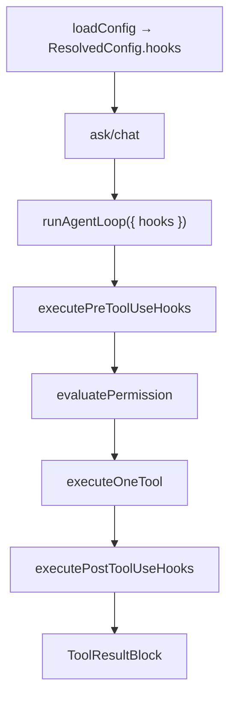
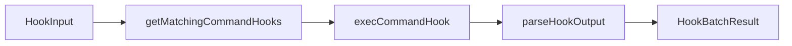

# nova-code 架构文档 · M10

> 适用版本：M10 Hooks 系统之后（PreToolUse / PostToolUse command hooks）
> 基线日期：2026-05-17

---

## 1. 模块布局

```text
src/services/hooks/
├── types.ts              HookEventName / HooksConfig / HookInput / HookJsonOutput
├── config.ts             validateHooksConfig：config.json runtime schema
├── matcher.ts            matcher 与轻量 if 条件过滤
├── execCommandHook.ts    Bun.spawn command hook 执行器
├── hookRunner.ts         批量执行 + stdout JSON 协议解释
├── index.ts
└── hooks.test.ts

src/QueryEngine.ts        工具生命周期插入 PreToolUse / PostToolUse
src/types/message.ts      AgentEvent 新增 hook_result
src/m10-e2e-hooks.test.ts 子进程 e2e
```

---

## 2. 数据流



关键集成点：

- `config.ts` 在 persisted config 中新增 `hooks?: HooksConfig`，resolved config 默认 `{}`；
- ask 直接把 `config.hooks` 传给 `runAgentLoop`；
- chat 经 `runChatRepl → ChatSession.sendTurn → runAgentLoop` 透传；
- `AgentEvent` 新增 `hook_result`，debug sink 会记录完整 stdout/stderr，普通 UI 只展示阻断 / warning / cancelled。

---

## 3. Hook runner 分层



`execCommandHook` 使用 Bun 原生能力：

- `Bun.spawn({ cmd, stdin, stdout: "pipe", stderr: "pipe" })`；
- stdin 是 `JSON.stringify(input) + "\n"`；
- 默认超时 30s，可用 hook `timeout`（秒）覆盖；
- `maxBuffer` 1 MiB，避免 hook 输出无限增长；
- 环境变量注入 `NOVA_CODE_HOOK_EVENT` / `NOVA_CODE_PROJECT_DIR` / `NOVA_CODE_SESSION_ID`。

---

## 4. QueryEngine 插入点

PreToolUse 在权限系统之前执行。它可以返回：

- `updatedInput`：替换后续 permission/tool execute 使用的 input；
- `permissionDecision: "deny"` 或 exit code 2：直接阻断；
- `additionalContext`：M10 记录但不额外注入（后续生命周期 hooks 再统一处理）。

PostToolUse 在工具执行后执行。它可以返回：

- `updatedOutput`：替换发给模型的 tool result；
- `additionalContext`：追加到 tool result 后；
- exit code 2：把 tool result 改为 `is_error=true`。

---

## 5. 安全边界

M10 hooks 是用户脚本，信任边界等价于用户手动在本机执行命令。安全策略：

- 不提供默认 hooks；
- 仅从用户显式配置的 `~/.nova-code/config.json` 读取；
- PreToolUse 后仍走 M3 权限系统，hook 不能绕过 DENY_PATTERNS；
- 非零且非 2 的 hook 失败默认非阻断，避免 hook 脆弱性中断正常工作；
- hook stdout 若以 `{` 开头必须是合法 JSON，否则按非阻断错误处理并提示。

---

## 6. 测试策略

| 层级 | 文件 | 断言 |
|---|---|---|
| Config | `config.test.ts` | hooks schema 合法/非法输入 |
| Matcher/Runner | `hooks.test.ts` | matcher、if、exit 2、updatedInput、updatedOutput |
| QueryEngine | `QueryEngine.test.ts` | 插入顺序、权限前输入改写、阻断不执行工具 |
| UI | `renderAgentEvent.test.ts` | hook_result 静默/阻断/warning/cancelled 渲染 |
| E2E | `m10-e2e-hooks.test.ts` | ask 子进程触发 Pre/Post hook，Post 改写 TodoWrite 输出 |

---

## 7. 交叉引用

- [M10 设计文档](../design/M10-hooks.md)
- [M10 使用手册](../manual/M10-usage-guide.md)
- [Roadmap](../roadmap.md)
