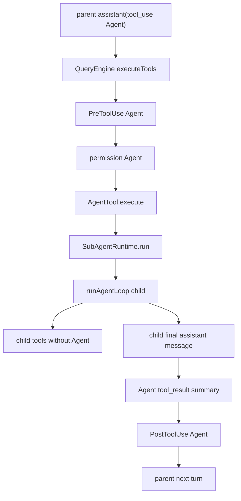

# nova-code 架构文档 · M11

> 适用版本：M11 AgentTool 之后（同步 one-shot 子 agent）
> 基线日期：2026-05-17

---

## 1. 模块布局

```text
src/Tool.ts                         SubAgentRuntime / SubAgentRunParams / SubAgentRunResult
src/tools/AgentTool/
├── constants.ts                     AGENT_TOOL_NAME / SubAgentTypeEnum
└── AgentTool.ts                     Tool schema、输入校验、结果格式化
src/tools.ts                        builtinTools 注册 AgentTool
src/QueryEngine.ts                   创建并注入 subAgentRuntime；内部递归 runAgentLoop
src/services/api/mockClient.ts       agent-loop mock 场景
src/m11-e2e-agent.test.ts            子进程 e2e
```

---

## 2. 数据流



父层 `AgentEvent` 只包含 `tool_call Agent` 与 `tool_result Agent`，不会透传子 agent 内部 `tool_call`。

---

## 3. ToolExecutionContext 扩展

M11 在 `ToolExecutionContext` 上新增：

```ts
readonly subAgentRuntime?: SubAgentRuntime;
```

现有工具忽略该字段；AgentTool 若发现未注入 runtime，会抛错并由 QueryEngine 转成 `is_error=true` tool_result。

---

## 4. QueryEngine 关键函数

| 函数 | 职责 |
|---|---|
| `createSubAgentRuntime` | 绑定当前 config/client/permission/hooks/cwd/signal/parentMessages |
| `runSubAgent` | 选择子 agent 类型、工具池，启动内部 `runAgentLoop` |
| `selectSubAgentTools` | 移除 `Agent` / `TodoWrite`；`explore` 只保留只读工具 |
| `buildSubAgentPromptParts` | 生成 child system prompt 与包含 parent context 的 user prompt |
| `collectSubAgentFinalMessage` | 手动消费 AsyncGenerator，拿到 return 的最终 NovaMessage |
| `extractTextFromMessage` | 把 child final assistant message 压成摘要字符串 |

---

## 5. 上下文与 compact

子 agent 不继承 parent messages 数组，而是继承文本化 parent context：

- 最近 24 条 parent messages；
- 单块最多 4,000 字符；
- 总 parent context 最多 24,000 字符。

子 agent 自己启用 auto-compact，并使用独立 tracking state。这样它可以处理较长子任务，但不会改写父 ChatSession 的历史。

---

## 6. 权限、hooks、MCP/skills

- permission mode/store/provider 原样复用；
- hooks 原样复用，session id 追加 `:agent:<description>` 后缀；
- MCP/Skill tool 若已在父工具池中，`general-purpose` 子 agent 可用；
- `explore` 子 agent 保留 Skill 和 Web 工具，但不保留 MCP 工具（M11 无只读 MCP 判别）。

---

## 7. 失败语义

子 agent 内部抛错时，AgentTool 的 `execute` promise reject；父 QueryEngine 复用既有 `describeToolError` 路径，生成：

```text
Tool 'Agent' threw: <reason>
```

并作为 `is_error=true` 的 Agent tool_result 发回父模型。父模型可据此重试、改用普通工具或向用户解释。

---

## 8. 测试策略

| 层级 | 文件 | 断言 |
|---|---|---|
| Unit | `QueryEngine.test.ts` | 子 agent 消耗额外 LLM call；child tools 不含 Agent；Agent result 含 child summary |
| Mock | `mockClient.ts` | `agent-loop` 父/子请求分流 |
| E2E | `m11-e2e-agent.test.ts` | `nova-code ask` 子进程可跑完整 AgentTool 闭环 |

---

## 9. 交叉引用

- [M11 设计文档](../design/M11-agent-tool.md)
- [M11 使用手册](../manual/M11-usage-guide.md)
- [Roadmap](../roadmap.md)
