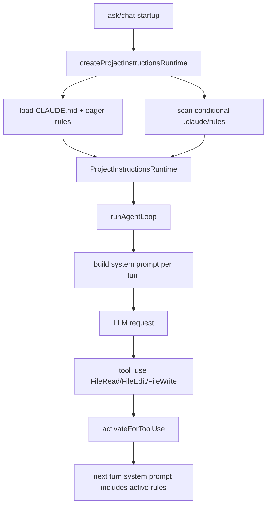

# nova-code 架构文档 · M12

> 适用版本：M12 `.claude/rules` 之后
> 基线日期：2026-05-17

---

## 1. 模块布局

```text
src/services/projectInstructions/claudeMd.ts
  CLAUDE.md / @include / HTML comment strip 共享实现

src/services/projectInstructions/rules.ts
  createProjectInstructionsRuntime
  DefaultProjectInstructionsRuntime
  .claude/rules 扫描、frontmatter paths 解析、Bun.Glob 匹配

src/QueryEngine.ts
  每轮重建 system prompt
  工具成功后调用 projectInstructionsRuntime.activateForToolUse(...)
  子 agent 继承 projectInstructionsRuntime

src/commands/AskCommand/runAskWithLLM.ts
  ask 启动时创建 ProjectInstructionsRuntime

src/commands/ChatCommand/ChatCommand.ts
src/commands/ChatCommand/runChatRepl.ts
src/commands/ChatCommand/ChatSession.ts
  chat 会话级持有 ProjectInstructionsRuntime，并跨 turn 复用 active rules

src/services/hooks/*
  HookEventName.INSTRUCTIONS_LOADED
  InstructionsLoadedHookInput

src/services/api/mockClient.ts
src/m12-e2e-rules.test.ts
  rules-loop mock 场景与 e2e
```

---

## 2. 核心数据结构

```ts
interface ProjectInstructionsRuntime {
  getInstructions(): string | undefined;
  activateForToolUse(params: ActivateProjectRulesParams): Promise<readonly ProjectRuleActivation[]>;
}
```

`getInstructions()` 返回当前 eager + active path rules 格式化后的 system instruction block。`activateForToolUse()` 只识别 `FileRead` / `FileEdit` / `FileWrite` 的 `path` 字段。

```ts
interface LoadedInstructionFile {
  readonly path: string;
  readonly content: string;
  readonly memoryType: "Managed" | "User" | "Project" | "Local";
  readonly globs?: readonly string[];
  readonly parent?: string;
}
```

`parent` 用于 `@include` 链路与 `InstructionsLoaded` hook 的 `parent_file_path`。

---

## 3. 数据流



M12 把 system prompt 从“loop 启动时构造一次”改为“每轮 LLM 调用前构造一次”，这是 path-scoped rules 能在工具调用后进入下一轮 prompt 的关键。

---

## 4. 加载算法

1. 找 git root，生成 `[gitRoot, ..., cwd]` 目录链。
2. 加载 managed/user/project/local CLAUDE.md 文件，沿用 M4 `@include` 递归语义。
3. 对每个 project dir 扫描 `.claude/rules/**/*.md`：
   - 无 `paths`：立即加载到 base files。
   - 有 `paths`：加载成 conditional rule catalog，但不进入 base prompt。
4. rule 内容进入模型前会：
   - 剥离 frontmatter；
   - 剥离块级 HTML comments；
   - 递归展开 `@include`，include 文件先于父文件出现。

---

## 5. 匹配算法

对一个工具调用：

```text
if toolName in {FileRead, FileEdit, FileWrite} and input.path is string:
  absoluteTarget = resolve(cwd, input.path)
  for rule in conditionalRules not yet active:
    rel = relative(rule.baseDir, absoluteTarget)
    if rel is inside baseDir and any Bun.Glob(glob).match(rel):
      activate(rule)
```

`rule.baseDir` 是包含 `.claude` 的目录。因此：

```text
/repo/.claude/rules/ts.md          paths: src/**/*.ts       => /repo/src/a.ts
/repo/packages/app/.claude/rules   paths: src/**/*.ts       => /repo/packages/app/src/a.ts
```

---

## 6. 子 agent 与 compact

- M11 子 agent 会继承父 `ProjectInstructionsRuntime`，因此子 agent 读取匹配文件也能激活同一套 path-scoped rules。
- 自动 compact 每轮使用当前 system prompt；若 rules 已激活，compact forked request 也能看到当前指令上下文。
- 手动 `/compact` 在 chat runtime 中使用当前 `ProjectInstructionsRuntime.getInstructions()` 构造 system prompt。

---

## 7. 测试策略

| 层级 | 文件 | 断言 |
|---|---|---|
| Unit | `src/services/projectInstructions/claudeMd.test.ts` | rule 扫描、frontmatter、comment strip、激活、优先级 |
| Unit | `src/QueryEngine.test.ts` | 第一轮 system 无 path rule，FileRead 后第二轮 system 有 path rule |
| E2E | `src/m12-e2e-rules.test.ts` | 真实 CLI 子进程 + mock LLM 完整闭环 |

---

## 8. 交叉引用

- [M12 设计文档](../design/M12-rules.md)
- [M12 使用手册](../manual/M12-usage-guide.md)
- [Roadmap](../roadmap.md)
