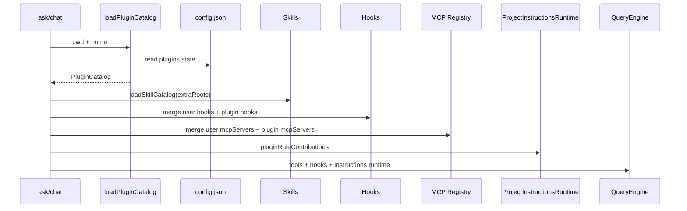

# nova-code 架构文档 · M13

> 适用版本：M13 Plugins 之后
> 基线日期：2026-05-18

---

## 1. 模块布局

```text
src/services/plugins/types.ts
  PluginManifest / LoadedPlugin / PluginCatalog / PluginSlashCommand 类型

src/services/plugins/manifest.ts
  plugin.json 读取、路径与 manifest schema 校验

src/services/plugins/loader.ts
  插件根目录发现、状态读取、贡献项加载、变量替换、MCP server 命名空间

src/services/plugins/slash.ts
  /plugin:command 解析与 prompt 展开

src/services/plugins/merge.ts
  HooksConfig / McpServersConfig 合并

src/commands/PluginCommand/PluginCommand.ts
  nova-code plugin list|enable|disable|reload|validate

src/config/config.ts
  PersistedConfig.plugins 状态持久化

src/services/skills/skillLoader.ts
  extraRoots 注入插件 skills

src/services/projectInstructions/rules.ts
  pluginRuleContributions 注入 M12 rules runtime

src/commands/AskCommand/runAskWithLLM.ts
src/commands/ChatCommand/ChatCommand.ts
src/commands/ChatCommand/runChatRepl.ts
  ask/chat 启动时加载插件 catalog 并接入贡献项
```

---

## 2. 核心数据结构

```ts
interface PluginManifest {
  readonly name: string;
  readonly version?: string;
  readonly description?: string;
  readonly skills: readonly string[];
  readonly commands: readonly string[];
  readonly rules: readonly string[];
  readonly hookFiles: readonly string[];
  readonly inlineHooks: readonly HooksConfig[];
  readonly mcpServerFiles: readonly string[];
  readonly inlineMcpServers: readonly McpServersConfig[];
}
```

manifest loader 会把可选字段归一化为数组，避免后续贡献加载逻辑处理多种 union shape。

```ts
interface PluginCatalog {
  readonly plugins: readonly LoadedPlugin[];
  readonly skillRoots: readonly string[];
  readonly slashCommands: readonly PluginSlashCommand[];
  readonly hooks: HooksConfig;
  readonly mcpServers: McpServersConfig;
  readonly ruleContributions: readonly PluginRuleContribution[];
  readonly warnings: readonly string[];
}
```

ask/chat 只消费 `PluginCatalog`，不直接读取插件目录。

---

## 3. 启动数据流



关键点：插件层只在启动时把贡献项转换成既有子系统输入；QueryEngine 不需要知道“某个 hook/skill/rule 来自插件”。

---

## 4. 发现与状态算法

1. 计算 roots：
   - 默认：`cwd/.nova-code/plugins`、`home/.nova-code/plugins`
   - `NOVA_PLUGIN_DIRS=a,b` 可覆盖，主要用于测试和临时实验
   - `NOVA_DISABLE_PLUGINS=1|true|yes` 直接返回空 catalog
2. 扫描 root 的直接子目录。
3. 读取 `plugin.json` 或 `.nova-code-plugin/plugin.json`。
4. 读取 `PersistedConfig.plugins[name]`。
5. 信任漂移检测：若 `state.path` 与当前发现路径不同（`path-changed`），或 `state.version` 与 manifest `version` 不一致（`version-changed`），降级为 untrusted 并发出 warning，强制用户重新 `enable --yes`。
6. 只有 `trusted === true && enabled === true` 的插件才加载贡献项。

重复 name 采用 first wins，后续插件进入 warnings，避免同名插件互相覆盖。

---

## 5. 贡献项加载细节

### 5.1 Skills

`loader.ts` 收集 enabled plugin 的 `skills/` 与 manifest `skills` 路径，只返回目录；实际 `SKILL.md` 解析仍由 M9 `loadSkillCatalog()` 完成。

### 5.2 Slash commands

`commands/**/*.md` 递归扫描后生成 `PluginSlashCommand`：

```text
relative path without .md -> ':' namespace
```

示例：`commands/java/review.md` 变成 `/demo:java:review`。

### 5.3 Hooks

hook 文件支持两种 JSON：

```json
{ "PostToolUse": [...] }
```

或：

```json
{ "hooks": { "PostToolUse": [...] } }
```

加载后调用 M10 `validateHooksConfig()`，再对 command hook 的 `command` / `statusMessage` 做 `${NOVA_PLUGIN_ROOT}` 替换。

### 5.4 MCP

MCP 文件支持两种 JSON：

```json
{ "echo": { "command": "bun", "args": ["./server.ts"] } }
```

或：

```json
{ "mcpServers": { "echo": { "command": "bun" } } }
```

加载后调用 M8 `validateMcpServersConfig()`，替换 `${NOVA_PLUGIN_ROOT}`，再把 server name 改成 `<plugin>_<server>`。

### 5.5 Rules

`PluginRuleContribution` 不提前解析 markdown，只把 `{ rulesPath, baseDir: cwd }` 传给 M12 runtime。这样插件 rules 与项目 `.claude/rules` 使用同一套 frontmatter、`@include` 与 activation 逻辑。

---

## 6. 运行时边界

- `plugin enable` 只是写 config，不执行插件代码。`enable --yes` 会同时记录 `path` 与 `version`，作为后续启动时的信任锚点。
- 只有 ask/chat 真正运行时才可能执行插件 hooks 或 MCP server。
- 禁用插件不会删除文件，也不会清除 trusted；仅把 `enabled` 置为 false。
- `reload` 在 headless CLI 中是一次 bookkeeping：重新扫描发现 enabled plugins 并刷新 `lastReloadedAt`，本身不重建任何运行中会话。已经在跑的 chat 必须重启才能看到插件改动。

---

## 7. 测试策略

| 层级 | 文件 | 断言 |
|---|---|---|
| Unit | `src/services/plugins/plugins.test.ts` | catalog、启用/禁用、贡献项消失 |
| Unit | `src/commands/PluginCommand/PluginCommand.test.ts` | CLI action 与 config 持久化 |
| E2E | `src/m13-e2e-plugins.test.ts` | ask 子进程完整消费 skill/slash/hook/rule |
| Regression | `bun test` 全量 | M8/M9/M10/M12 行为未回归 |

---

## 8. 交叉引用

- [M13 设计文档](../design/M13-plugins.md)
- [M13 使用手册](../manual/M13-usage-guide.md)
- [Roadmap](../roadmap.md)
