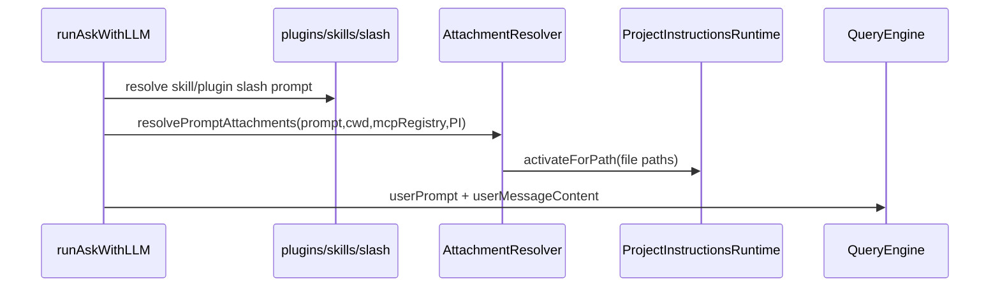
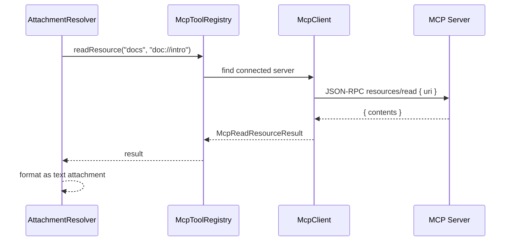

# nova-code 架构文档 · M14

> 适用版本：M14 Attachments 之后
> 基线日期：2026-05-19

---

## 1. 模块布局

```text
src/services/attachments/types.ts
  AttachmentMention / ResolvedPromptAttachment / McpResourceReader / extra paste/image 类型

src/services/attachments/parser.ts
  prompt 扫描与 @-mention 轻量解析

src/services/attachments/resolver.ts
  文件、目录、glob、图片、MCP resource 读取与 NovaMessage.content 构造

src/services/attachments/index.ts
  对外导出 resolver/parser/types

src/types/message.ts
  NovaContentBlock 新增 ImageBlock

src/QueryEngine.ts
  AgentLoopParams.userMessageContent；SDK content block 转换支持 image

src/commands/AskCommand/runAskWithLLM.ts
src/commands/ChatCommand/runChatRepl.ts
src/commands/ChatCommand/ChatSession.ts
  ask/chat 共享 resolver，并把结构化 user content 写入会话历史

src/services/projectInstructions/rules.ts
  ProjectInstructionsRuntime.activateForPath()

src/services/mcp/*
  McpClient.readResource() 与 registry 级 resource bridge
```

---

## 2. 核心数据结构

```ts
interface ResolvePromptAttachmentsParams {
  readonly prompt: string;
  readonly cwd: string;
  readonly signal?: AbortSignal;
  readonly mcpRegistry?: McpResourceReader;
  readonly projectInstructionsRuntime?: ProjectInstructionsRuntime;
  readonly extraAttachments?: readonly ExtraPromptAttachment[];
}
```

`extraAttachments` 是为 M17 TUI paste queue 预留的最小模型；当前 headless/readline 路径主要消费 prompt 中的 @-mention。

```ts
interface ResolvedPromptAttachment {
  readonly kind: ResolvedAttachmentKind;
  readonly label: string;
  readonly text?: string;
  readonly image?: ImageBlock;
  readonly path?: string;
  readonly referencedFilePaths: readonly string[];
  readonly truncated: boolean;
}
```

`referencedFilePaths` 是 M12 rules 联动的唯一输入：resolver 不关心 rule frontmatter，只把“这个附件明确命中的文件路径”交给 `ProjectInstructionsRuntime.activateForPath()`。

策略：`FILE` / `DIRECTORY` / `GLOB` 填入对应文件路径；`IMAGE` / `MCP_RESOURCE` / `PASTE_TEXT` 始终是空数组——这些来源不参与代码 path-glob 匹配，避免触发与意图无关的 rule。

---

## 3. ask/chat 接入点

### ask



### chat

`runChatRepl` 在普通用户 turn 中执行 resolver；`ChatSession.sendTurn()` 新增 `ctx.userMessageContent`，确保成功提交会话历史时写入的是结构化 content，而不是丢失附件后的纯字符串。

斜杠命令仍然优先：如果输入被 `/compact`、`/save` 等内置命令处理，不进入 resolver；如果是 skill/plugin slash 展开，本轮展开后的 prompt 会继续走 resolver。

---

## 4. QueryEngine 转换边界

`runAgentLoop` 保持 `userPrompt` 必填，用于日志、子 agent prompt 与向后兼容；M14 只新增可选字段：

```ts
readonly userMessageContent?: NovaMessage["content"];
```

构造 messages 时：

```ts
content: params.userMessageContent ?? userPrompt
```

SDK 转换层 `toSdkContentBlock()` 新增 image 分支。compact / partialCompact 的 forked-agent 请求也同步支持 image block，避免包含图片附件的 chat 会话在 compact 时类型失配。

---

## 5. MCP resource 数据流



`McpReadResourceResult` 只建模 M14 需要的 `contents[]`：`uri`、`mimeType`、`text`、`blob`。`blob` 当前不直接转多模态 block，只输出摘要，避免不明 MIME 内容污染上下文。

---

## 6. 截断与去重策略

| 对象 | 策略 |
|---|---|
| 文件文本 | 最多读取 32KB，注入最多 24K chars；UTF-8 边界用 `TextDecoder({fatal:false})` 兜底 |
| 二进制文件 | head 4KB 探测 NUL byte；命中即输出 `[binary file omitted]` 占位 |
| 目录 | 最多 120 个直接子项，不递归 |
| glob 扫描 | 命中 500 项即停（hard cap），surface 前 20 项 |
| glob 输入 | 仅接受相对 cwd 模式，绝对路径与 `~/` 拒绝并 warning |
| 图片 | 仅支持 jpeg/png/gif/webp，最大 5MB；compact 时替换为文本占位 |
| MCP text | 最多 24K chars |
| 去重 | 同一文件绝对路径只注入一次；同一 mention kind/value 只解析一次 |
| 中断 | resolver 抛 nova `AbortError`（非 DOMException），ask/chat 统一映射成 `[cancelled]` / exit 130 |

这些上限是 M14 的保守默认值。它们不替代 M4 auto-compact；M4 仍按 messages 粗估 token 触发压缩。

---

## 7. 测试策略

| 层级 | 文件 | 断言 |
|---|---|---|
| Unit | `src/services/attachments/attachments.test.ts` | parser / resolver / dedupe / rules activation |
| Unit | `src/QueryEngine.test.ts` | 结构化 user content 透传 SDK request |
| Unit | `src/services/mcp/McpStdioClient.test.ts` | stdio `resources/read` |
| Unit | `src/services/mcp/mcpToolRegistry.test.ts` | registry readResource server 查找 |
| E2E | `src/m14-e2e-attachments.test.ts` | ask 子进程首轮注入文件内容与 path rule |
| Regression | `bun test` 全量 | 旧工具循环、compact、MCP tools、rules、plugins 不回归 |

---

## 8. 交叉引用

- [M14 设计文档](../design/M14-attachments.md)
- [M14 使用手册](../manual/M14-usage-guide.md)
- [Roadmap](../roadmap.md)
