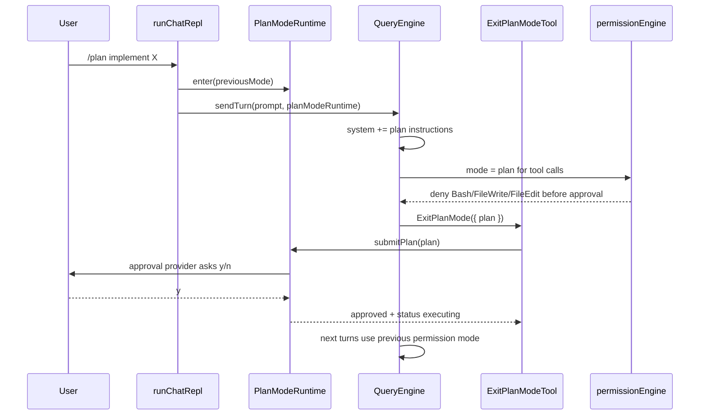

# nova-code 架构文档 · M15

> 适用版本：M15 Plan Mode 之后
> 基线日期：2026-05-24

---

## 1. 模块布局

```text
src/services/plan/types.ts
  PlanModeStatusEnum / PlanApprovalProvider / PlanModeRuntime

src/services/plan/planModeRuntime.ts
  默认状态机实现，负责状态转换、权限模式恢复、system prompt 文案

src/services/plan/prompt.ts
  planning 与 approved plan 的 system instruction formatter

src/services/plan/interactivePlanApprovalProvider.ts
  chat REPL 的 y/n plan 审批 provider

src/tools/EnterPlanModeTool/EnterPlanModeTool.ts
  模型主动进入 Plan Mode

src/tools/ExitPlanModeTool/ExitPlanModeTool.ts
  模型提交 plan 并触发审批

src/commands/ChatCommand/slash/plan.ts
  用户 `/plan` slash command

src/QueryEngine.ts
  注入 PlanModeRuntime，动态 system prompt 与有效权限模式

src/services/permissions/permissionEngine.ts
  mode === "plan" 时拦截 Bash/FileWrite/FileEdit
```

---

## 2. 数据流



---

## 3. QueryEngine 集成点

`AgentLoopParams` 新增：

```ts
readonly planModeRuntime?: PlanModeRuntime;
```

每轮 LLM 请求前，QueryEngine 把 plan instructions 合并进 project instructions：

```ts
projectInstructions: mergeInstructionBlocks(
  params.planModeRuntime?.getSystemInstructions(),
  params.projectInstructionsRuntime?.getInstructions(),
  params.projectInstructions,
)
```

每次工具权限判定前，QueryEngine 动态读取有效权限模式：

```ts
const effectivePermissionMode =
  planModeRuntime?.getEffectivePermissionMode(permissionMode) ?? permissionMode;
```

这保证 `ExitPlanMode` 获批后，即使仍在同一次 agent loop 内，下一轮工具也能按进入前权限模式执行。

---

## 4. ToolExecutionContext 扩展

M15 扩展工具上下文：

```ts
interface ToolExecutionContext {
  readonly signal: AbortSignal;
  readonly permissionMode?: PermissionMode;
  readonly planModeRuntime?: PlanModeRuntime;
  readonly subAgentRuntime?: SubAgentRuntime;
}
```

- `EnterPlanModeTool` 使用 `permissionMode` 记录进入前模式。
- `ExitPlanModeTool` 使用 `planModeRuntime.submitPlan(plan)` 触发审批。
- `AgentTool` 继续使用 `subAgentRuntime`，但 M15 增加 `subagent_type: "plan"`。

---

## 5. 权限层顺序

`permissionEngine` 的关键顺序：

1. Bash 内置 DENY_PATTERNS。
2. `mode === "plan"` 时拒绝 Bash/FileWrite/FileEdit。
3. `bypassPermissions`。
4. 三层 deny 规则。
5. 三层 allow/ask 规则。
6. `acceptEdits`。
7. `requiresApproval`。
8. 默认 allow。

Plan Mode 位于 bypass 与 allow 规则之前，确保任何用户规则都不能在批准前绕过写权拦截。

---

## 6. Slash command 控制流

`SlashResult` 增加：

```ts
{ action: "submit"; input: string }
```

`/plan <prompt>` 的执行路径：

1. `planCommand` 调用 `planModeRuntime.enter()`。
2. `permissionModeRef.set("plan")`。
3. 返回 `{ action: "submit", input: prompt }`。
4. `runChatRepl` 不 `continue`，而是把 `input` 作为普通 turn 继续送入 `ChatSession.sendTurn()`。

这样用户无需先 `/plan` 再重复输入需求。

---

## 7. 子 agent 工具集

`SubAgentTypeEnum.PLAN` 与 `EXPLORE` 共用只读工具白名单：

```text
LS, FileRead, Grep, Glob, WebFetch, WebSearch, Skill
```

`plan` 子 agent 的 system hint 要求输出计划而不是执行。若父 agent 已处于 Plan Mode，子 agent 还会共享 `PlanModeRuntime`，形成双层保护。

---

## 8. 测试策略

| 层级 | 文件 | 断言 |
|---|---|---|
| Unit | `src/services/plan/planModeRuntime.test.ts` | 状态转换、批准恢复、拒绝保持 plan |
| Unit | `src/QueryEngine.test.ts` | plan 权限拦截、同 loop 获批后执行 |
| Unit | `src/commands/ChatCommand/slash/plan.test.ts` | `/plan`、`/plan <prompt>`、`/plan status` |
| E2E | `src/m15-e2e-plan-mode.test.ts` | 子进程 chat 完整审批与 FileWrite |
| Regression | `bun test` 全量 | 权限系统、hooks、MCP、attachments、plugins 不回归 |

---

## 9. 交叉引用

- [M15 设计文档](../design/M15-plan-mode.md)
- [M15 使用手册](../manual/M15-usage-guide.md)
- [Roadmap](../roadmap.md)
