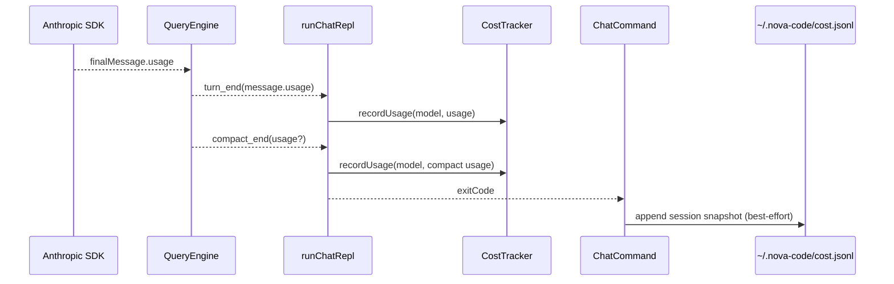
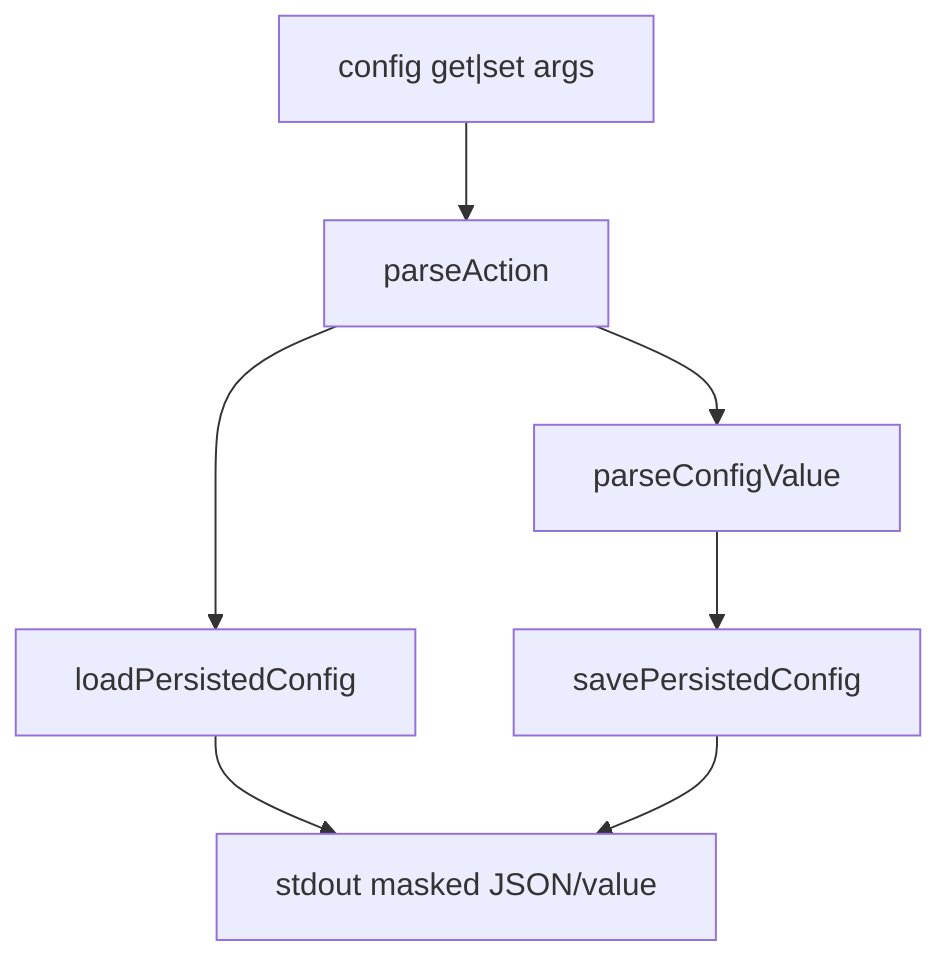

# nova-code 架构文档 · M5

> 适用版本：M5 完成之后（Cost、Config CLI、init 上线）
> 基线日期：2026-05-14
> 文档目标：让读者快速理解 M5 新增的 cost 统计链路、配置 CLI、CLAUDE.md 初始化命令，以及它们与 M4 agent loop 的耦合点

---

## 1. 模块总览

```text
src/services/cost/
├── pricing.ts              模型价格表 + usage cost formula
├── CostTracker.ts          会话内累计 + snapshot + formatter
├── ledger.ts               ~/.nova-code/cost.jsonl 持久化
└── index.ts                聚合导出

src/commands/
├── CostCommand/            nova-code cost [--json]
├── ConfigCommand/          nova-code config get|set
└── InitCommand/            nova-code init [--force]
```

M5 只新增边缘能力，核心 agent loop 仍由 `src/QueryEngine.ts` 驱动。

---

## 2. Cost 数据流



### 2.1 事件层扩展

`AgentEvent.compact_end` 从 M5 起多一个可选字段：

```ts
readonly usage?: ApiUsage;
```

它只在 compact 成功时存在。字段可选保证 M4 消费者不需要改。

### 2.2 手动 `/compact` 的旁路

手动 `/compact` 不经过 `renderAgentEvent`，因此由 `slash/compact.ts` 在拿到 `ChatCompactOutcome.compactionUsage` 后直接调用：

```ts
chatRuntime.costTracker?.recordUsage(chatRuntime.config.model, outcome.compactionUsage);
```

这保证普通 turn、auto compact、manual compact 三类 LLM 调用都进同一份 session summary。

### 2.3 Ledger 结构

`~/.nova-code/cost.jsonl` 每行一条：

```ts
interface CostLedgerEntry {
  readonly schemaVersion: 1;
  readonly createdAt: string;
  readonly command: "chat" | "ask";
  readonly exitCode: number;
  readonly snapshot: CostSnapshot;
  readonly sessionId?: string;
}
```

M5 只写 `command: "chat"`；`ask` 枚举先预留，后续可复用。

---

## 3. Pricing 子系统

`pricing.ts` 不联网，不读取远程价格；它是一个静态快照。

```text
getModelPricing(model)
  ├─ substring rules: opus-4-5 / sonnet-4-5 / haiku-4-5 / ...
  ├─ hit      → canonicalName + pricing
  └─ miss     → Sonnet 4.x fallback + usedFallback=true
```

`calculateUsageCostUsd()` 接受 `ApiUsage`，按 input/output/cache creation/cache read 四项相加。当前 cache creation 采用 5-minute prompt cache write rate；如果未来 request 侧显式使用 1-hour cache，需要扩展数据模型。

---

## 4. Config CLI

`ConfigCommand` 是 `src/config/config.ts` 的薄 CLI 包装：



关键边界：

- `config get` 不调用 `loadConfig()`，所以不会因为缺 API key 报错。
- `apiKey` 只在写入文件时保存原值；所有 stdout 都走 `maskSecret()`。
- `maxTokens` / `maxTurns` 在 CLI 层先做正整数校验，再交给 `savePersistedConfig()` 的 schema 校验兜底。

---

## 5. Init CLI

`InitCommand` 的责任非常小：

1. 解析 `--force`；
2. 检查 `./CLAUDE.md` 是否存在；
3. 用 `Bun.write()` 写入最小模板；
4. 返回 exit code。

它不读取仓库结构、不调用模型、不生成 skills/hooks。原因是 M5 还没有 prompt command / AskUserQuestion / 子 agent 初始化流水线；做静态模板能先满足“生成 CLAUDE.md”，同时避免把复杂 agent workflow 塞进普通 CLI 命令。

---

## 6. 与历史架构的关系

- M2 提供 chat REPL 与 slash command 框架；M5 在 `runChatRepl` 里监听 usage 并在 `/exit` / EOF 前打印 cost。
- M4 提供 `NovaMessage.usage` 与 compact usage；M5 直接消费，不重新估算。
- M5 新增 `getCostLedgerPath()`，与 `getConfigFilePath()` / `getSessionsDirPath()` 同属 `src/config/config.ts` 路径工具。

---

## 7. 设计原则增量

18. **真实 usage 优先于估算**：cost 只消费 SDK 返回的 `message.usage`，不自己 tokenizer 估算。
19. **进程边界显式持久化**：普通 CLI 子命令不能读取已退出 chat 的内存，所以 cost summary 必须落 ledger。
20. **统计失败不影响主任务**：ledger 写入是 best-effort；失败只警告，不改变 chat 退出码。
21. **CLI 命令保持薄层**：config/init/cost 都把复杂逻辑压到 service 或纯 helper，命令层只做参数解析和 I/O。

---

## 8. 交叉引用

- [M5 设计文档](../design/M5-cost-config-init.md)
- [M5 使用手册](../manual/M5-usage-guide.md)
- [Roadmap](../roadmap.md)
- [M4 架构文档](./M4/README.md)
