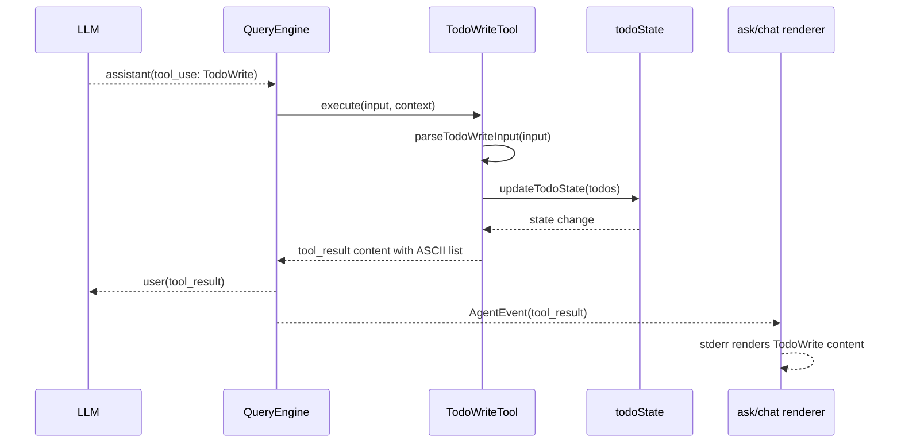

# nova-code 架构文档 · M6

> 适用版本：M6 完成之后（TodoWrite 工具上线）
> 基线日期：2026-05-14
> 文档目标：说明 TodoWrite 的工具实现、状态作用域、prompt 注入和 ask/chat 渲染路径。

---

## 1. 模块总览

```text
src/tools/TodoWriteTool/
├── constants.ts
├── prompt.ts
├── todoTypes.ts
├── todoState.ts
├── renderTodoList.ts
└── TodoWriteTool.ts
```

M6 仍复用 M1 的 `Tool` 抽象，不改变 `QueryEngine` 的工具执行协议。

---

## 2. 执行数据流



---

## 3. 状态作用域

`todoState.ts` 持有模块级变量：

```ts
let currentTodos: readonly TodoItem[] = [];
```

写入语义：

1. 保存旧状态；
2. 判断本次提交是否全部 `completed`；
3. 全部完成则存储 `[]`，否则存储提交列表副本；
4. 返回 `submittedTodos`，用于即使清空后也能渲染完成列表。

M6 的状态是**进程级**。原因是当前 `ToolExecutionContext` 只有 abort signal，没有 sessionId / agentId。M11 AgentTool 到来时，可把状态表改为：

```text
Map<sessionId, Map<agentId, TodoItem[]>>
```

---

## 4. Prompt 注入

`buildSystemPrompt()` 新增 `toolNames?: readonly string[]` 参数：

```text
默认 system prompt
  + TodoWrite guidance（仅当 toolNames 包含 TodoWrite 且未显式传 systemPrompt）
  + projectInstructions（CLAUDE.md）
```

为什么显式 `systemPrompt` 不自动追加：`/compact` 和后续 forked-agent 路径会传入已构造好的 system prompt；再次追加会造成 prompt 重复，也会破坏 prompt cache 一致性。

`runChatRepl` 中 slash runtime 的 `systemPrompt` 也通过同一个 `buildSystemPrompt({ toolNames, projectInstructions })` 构造，保证手动 `/compact` 与主循环共享同款 system prompt。

---

## 5. 渲染路径

`AgentEvent.tool_result` 默认成功静默；M6 增加 TodoWrite 特例：

- `runAskWithLLM.ts`：ask 进程直接在 switch 分支写 stderr；
- `renderAgentEvent.ts`：chat REPL 的共享渲染器写 stderr。

这样用户能看到规划状态，同时不会暴露 FileRead / Grep 等普通工具结果。

---

## 6. Mock transport 扩展

`src/services/api/mockClient.ts` 新增：

```text
NOVA_MOCK_SCENARIO=todo-loop
```

该场景第一轮返回 `TodoWrite` tool_use，第二轮返回 `end_turn`。它用于 `src/m6-e2e-todowrite.test.ts`，验证完整路径：配置加载 → mock LLM → QueryEngine → TodoWriteTool → ask renderer。

---

## 7. 与历史架构的关系

- M1 提供工具注册表和 `Tool` 接口；M6 只新增一个 tool 实现。
- M2 提供 chat renderer；M6 复用 `renderAgentEvent`。
- M4 提供 `buildSystemPrompt()` 和 project instructions 拼接；M6 在同一函数中追加 TodoWrite guidance，保持 prompt cache 边界集中。
- M5 cost 统计不受影响：TodoWrite 不产生 LLM usage，只是普通 tool result。

---

## 8. 设计原则增量

22. **规划状态应用户可见**：TodoWrite 是 agent 的工作计划，不应像普通工具成功结果一样完全静默。
23. **工具可用才提示模型使用**：避免 system prompt 引导模型调用不存在的工具。
24. **状态先简单后精确**：M6 用进程级状态满足单会话需求；等 AgentTool 有 agentId 后再精细化作用域。
25. **prompt cache 边界集中**：主循环和 forked-agent / compact 共享 `buildSystemPrompt()`，避免系统提示漂移。

---

## 9. 交叉引用

- [M6 设计文档](../design/M6-todowrite.md)
- [M6 使用手册](../manual/M6-usage-guide.md)
- [Roadmap](../roadmap.md)
- [M5 架构文档](./M5-architecture.md)
