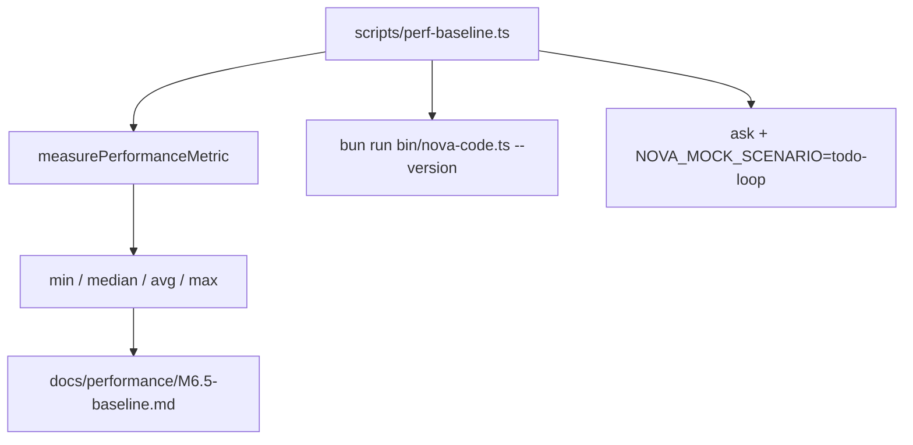

# nova-code 架构文档 · M6.5

> 适用版本：M6.5 完成之后（Phase 1 稳定化窗口）
> 基线日期：2026-05-14
> 文档目标：说明 UUID sessionId、Phase 1 e2e 矩阵和 performance baseline 的实现边界。

---

## 1. sessionId 模块

源文件：`src/commands/ChatCommand/sessionId.ts`


M6.5 后 `generateSessionId()` 只接受一个可注入的 UUID provider：

```ts
export function generateSessionId(createUuid: () => string = randomUUID): string
```

函数会校验 provider 返回 canonical UUID v4。生产路径使用 Node/Bun 的 `crypto.randomUUID()`；测试路径注入固定 UUID。

---

## 2. sessionStore 兼容边界

`sessionStore` 不校验 `meta.sessionId` 是否为 UUID。原因：历史 M2-M6 版本已经可能写出 timestamp 形态文件。M6.5 的兼容策略是：

- 新会话只生成 UUID v4；
- 旧文件名只要通过 `assertSafeFileName`，仍可 `/load` / `--resume`；
- 不做批量迁移，避免用户已有 alias 或脚本被破坏。

---

## 3. E2E 矩阵

```text
src/integration.test.ts          M1/M1.5 tools + writeflow
src/m2-e2e-chat.test.ts          M2 REPL / save / resume / SIGINT
src/m6-5-e2e-phase1.test.ts      M3 permissions child-process path
src/m4-e2e-compact.test.ts       M4 compact / CLAUDE.md
src/m5-e2e-cost.test.ts          M5 cost ledger
src/m6-e2e-todowrite.test.ts     M6 TodoWrite
```

新增的 `m6-5-e2e-phase1` 使用现有 `edit-loop` mock scenario，而不是新增 mock 剧本：同一条 Grep → FileEdit → Bash 流水线能同时验证写权工具和权限模式。

---

## 4. Performance baseline 架构



统计 helper 放在 `src/services/performance/perfBaseline.ts`，因此纳入 `tsc --noEmit` 和单测；脚本本身保留在 `scripts/`，通过 `bun run perf:baseline` 调用。

---

## 5. 设计原则增量

26. **session identity 不承载排序语义**：排序交给文件 mtime / ledger；sessionId 只做身份。
27. **历史文件不迁移**：能读旧数据比格式洁癖更重要。
28. **性能基线独立于单测**：baseline 要可重复运行，但不能让 CI 因机器负载 flaky。
29. **Phase 1 主路径必须子进程可验证**：关键 CLI 行为不能只停留在 fake client 单测。

---

## 6. 交叉引用

- [M6.5 设计文档](../design/M6.5-phase1-stabilization.md)
- [M6.5 使用手册](../manual/M6.5-usage-guide.md)
- [Performance baseline](../performance/M6.5-baseline.md)
- [Roadmap](../roadmap.md)
