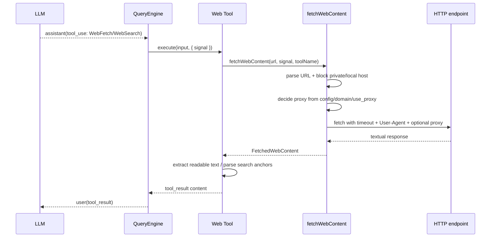

# nova-code 架构文档 · M7

> 适用版本：M7 完成之后（WebFetch / WebSearch 上线）
> 基线日期：2026-05-14
> 文档目标：说明 Web 工具的模块划分、共享 fetch pipeline、安全边界、mock/e2e 接入和后续演进点。

---

## 1. 模块总览

```text
src/tools/WebFetchTool/
├── constants.ts              工具名、超时、字节/字符上限、User-Agent
├── extractReadableText.ts    HTML/text 抽取与 entity decode
├── fetchWebContent.ts        共享 HTTP fetch + URL/SSRF/content-type/timeout/proxy 边界
├── webProxyConfig.ts         webProxy / webProxyDomains / use_proxy 路由决策
├── WebFetchTool.ts           Tool 实现
└── WebFetchTool.test.ts      单测

src/tools/WebSearchTool/
├── constants.ts              工具名、默认 endpoint、结果/HTML 上限
├── WebSearchTool.ts          Tool 实现 + HTML anchor 结果解析 + 域名过滤
└── WebSearchTool.test.ts     单测
```

M7 仍复用 M1 的 `Tool` 抽象，不改变 `QueryEngine` 的工具执行协议。

---

## 2. 执行数据流



`context.signal` 继续贯穿工具执行。M7 在其外层叠加 15s timeout signal，并在 finally 中清理 timeout 与 parent listener。

---

## 3. 共享 fetch pipeline

`fetchWebContent()` 是两个 Web 工具的唯一网络入口：

1. `parseHttpUrl()`：校验 URL 合法、协议为 HTTP(S)、host 非 private/local；
2. `fetch()`：传入 `Accept` 与 `User-Agent`，复用上游 AbortSignal；
3. `readResponse()`：要求 `response.ok` 与 textual content-type；
4. `arrayBuffer()`：读取响应 bytes，超过 1MB 只解码前 1MB；
5. 按 `webProxyDomains` 或工具入参 `use_proxy` 决定是否设置 Bun `fetch` 的 `proxy` 选项；
6. 返回 `FetchedWebContent`，保留 requested/final URL、status、content-type、bytes、truncated 标记、rawText 与 proxy decision 元信息。

private/local host 判定覆盖：

- `localhost` / `*.localhost`；
- IPv4：`0/8`、`10/8`、`127/8`、`100.64/10`、`169.254/16`、`172.16/12`、`192.168/16`、`198.18/15`、`224/4+`；
- IPv6：`::`、`::1`、`fc00::/7`、`fe80::/10` 的轻量前缀判断。

本地测试通过 `NOVA_WEB_ALLOW_PRIVATE_HOSTS=1` 显式绕过。

---

## 4. Web proxy routing

`webProxyConfig.ts` 合并两类来源：

- 配置文件：`webProxy` / `webProxyDomains`；
- 环境变量：`NOVA_WEB_PROXY` / `NOVA_WEB_PROXY_DOMAINS`，优先级高于配置文件。

决策顺序：

1. 目标 host 命中域名后缀规则，例如 `example.com` 匹配 `docs.example.com`；
2. 或模型在工具入参中设置 `use_proxy=true`；
3. 若需要代理但没有配置 proxy URL，抛 `ToolExecutionError`；
4. 若命中，调用 Bun 原生 `fetch(url, { proxy: proxyUrl })`。

代理 URL 支持 `http://` / `https://`，可携带用户名密码。工具输出只展示 `Proxy: used` 与来源，不展示 URL，避免把凭证写入对话历史。

---

## 5. WebFetchTool

职责边界：

- 入参校验：`url` 必填 string，`prompt` 可选 string；
- 网络读取：调用 `fetchWebContent()`；
- 正文抽取：`extractReadableText(rawText, contentType)`；
- 输出格式：元信息 + prompt + 抽取正文；正文最多 50K chars。

HTML 抽取策略：

- 删除 comment / `script` / `style` / `noscript` / `svg`；
- 对 `br` 与常见 block closing tag 插入换行；
- strip HTML tags；
- 解码常用 named entity、decimal entity、hex entity；
- 对每行 trim 并删除空行。

这是轻量 readability，不试图保留 DOM 结构或语义层级。

---

## 6. WebSearchTool

职责边界：

- 入参校验：`query` 必填且长度 >= 2；`allowed_domains` / `blocked_domains` 可选且互斥；
- endpoint：默认 `https://duckduckgo.com/html/`，可由 `NOVA_WEB_SEARCH_ENDPOINT` 覆盖；
- 查询参数：统一通过 `url.searchParams.set("q", query)` 注入；
- HTML 解析：扫描 `<a href="...">title</a>`，支持直接 HTTP(S) URL 与 DuckDuckGo `/l/?uddg=...` 跳转；
- 去重与过滤：按 URL 去重，按 normalized hostname 做 allow / block；
- 输出：最多 8 条编号结果。

M7 没有引入 provider-aware server-side search，避免让 Tool 层直接依赖 Anthropic client。后续若补齐，应在 services/api 层抽象 provider 能力。

---

## 7. Mock transport 与 e2e

`src/services/api/mockClient.ts` 新增：

```text
NOVA_MOCK_SCENARIO=web-loop
```

剧本：

1. 第 1 轮：返回 `WebFetch({ url: MOCK_WEB_URL, prompt })`；
2. 第 2 轮：返回 `WebSearch({ query: "nova code web tools" })`；
3. 第 3 轮：`end_turn`，输出 `Done. Web tools completed.`。

`src/m7-e2e-web.test.ts` 启动本地 Bun HTTP fixture，并设置 `NOVA_WEB_ALLOW_PRIVATE_HOSTS=1`。该测试覆盖真实子进程 ask 主路径，而不是只测纯函数。

---

## 8. 与历史架构的关系

- M1 提供 `Tool` 接口、注册表与 `findTool()`；M7 只新增两个 Tool 实现。
- M3 权限系统不需要改动：两个 Web 工具只读，`requiresApproval=false`，安全边界由工具内部 URL guard 承担。
- M4 compact / prompt cache 不需要改动：M7 不追加 system prompt，也不引入 nested LLM call。
- M5 cost 不受影响：Web 工具本身无 SDK usage；模型处理 tool_result 的 token 仍由原有 usage 统计覆盖。
- M6 TodoWrite 渲染特例不受影响：WebFetch / WebSearch 成功结果继续默认静默。

---

## 9. 设计原则增量

26. **Web 工具先只读、再授权**：公开 Web fetch/search 不应默认打开本机和内网访问。
27. **网络入口集中**：所有 Web 工具共享 `fetchWebContent()`，把 timeout、content-type、SSRF、截断放在一个地方。
28. **provider 能力不上移到 Tool 层**：WebSearch 的 server-side provider parity 等 API 层有 provider abstraction 后再补。
29. **e2e 必须离线可跑**：默认搜索 endpoint 可替换，本地 fixture 可覆盖完整 agent loop。
30. **代理路由不泄露凭证**：proxy URL 可配置和带认证，但 tool_result / UI 只展示是否使用代理。
31. **LLM 可以判断但不能自造代理**：模型只能通过 `use_proxy=true` 请求使用既有配置，不能传任意代理 URL。

---

## 10. 交叉引用

- [M7 设计文档](../design/M7-web-tools.md)
- [M7 使用手册](../manual/M7-usage-guide.md)
- [Roadmap](../roadmap.md)
- [M6.5 架构文档](./M6.5-architecture.md)
