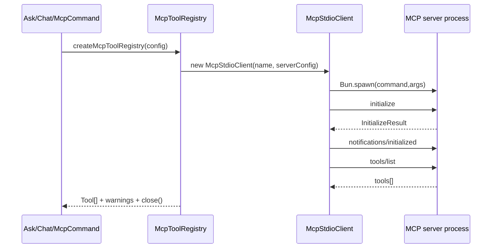

# nova-code 架构文档 · M8

> 适用版本：M8 完成之后（MCP stdio tools 上线）
> 基线日期：2026-05-15
> 文档目标：说明 MCP client 子系统、配置模型、工具桥接、命令入口和测试 fixture。

---

## 1. 模块布局

```text
src/services/mcp/
├── types.ts                    MCP 配置、协议结果、content block 类型
├── McpStdioClient.ts           stdio JSON-RPC client
├── mcpToolRegistry.ts          MCP tool → nova Tool bridge
├── index.ts                    公共出口
├── McpStdioClient.test.ts
├── mcpToolRegistry.test.ts
└── fixtures/stdioEchoServer.ts 本地 e2e/unit MCP server

src/commands/McpCommand/
├── McpCommand.ts               mcp list/add/remove/tools
└── McpCommand.test.ts

src/m8-e2e-mcp.test.ts          ask 子进程 + mock LLM + MCP fixture
```

集成点：

- `src/config/config.ts`：新增 `mcpServers` schema 与运行时校验；
- `src/commands.ts`：注册 `mcp` 命令；
- `AskCommand` / `ChatCommand`：启动时创建 `McpToolRegistry`，把 `builtinTools + mcpTools` 传给 QueryEngine；
- `mockClient.ts`：新增 `NOVA_MOCK_SCENARIO=mcp-loop`；
- `ConfigCommand`：全量 `config get` 时脱敏 MCP env。

---

## 2. 启动与发现流程



M8 选择在 ask/chat 启动时一次性发现工具。chat 会话期间不动态刷新工具列表；如果用户修改 MCP 配置，需要重启 chat。

---

## 3. McpStdioClient

`McpStdioClient` 是最小协议 client：

- 用 `Bun.spawn({ stdin:"pipe", stdout:"pipe", stderr:"pipe" })` 启动 server；
- stdout 按行读取，每行解析一个 JSON-RPC message；
- pending request 以递增 number id 管理；
- 每个 request 有 `timeoutMs`；
- 支持 AbortSignal；
- server request 中只响应 `ping`，其它 request 返回 `-32601 Method not found`；
- stderr 保留最后 8K 字符，用于启动失败 warning。

实现的 MCP 方法：

```text
initialize
notifications/initialized
tools/list
tools/call
```

---

## 4. Tool bridge

`mcpToolRegistry.ts` 把每个 MCP tool 转成 nova `Tool`：

```ts
{
  name: "MCP__fixture__echo",
  description: "MCP server 'fixture' tool 'echo'. ...",
  input_schema: mcpTool.inputSchema,
  requiresApproval: server.autoApprove !== true,
  execute: async (input, context) => client.callTool(originalName, input, context.signal)
}
```

`tools/call` 返回值格式化规则：

- `text` block：直接输出文本；
- `image` / `audio`：只输出 mimeType 与 base64 长度，不把二进制灌入上下文；
- `resource_link`：输出 URI；
- `resource` / unknown block：JSON stringify；
- `structuredContent`：追加到 “Structured content” 段；
- 总输出最多 50K chars。

若 MCP result `isError=true`，bridge 抛 `ToolExecutionError`，让 QueryEngine 生成 `is_error=true` 的 tool_result。

---

## 5. 命令入口

`nova-code mcp` 是轻量配置管理入口：

```bash
nova-code mcp list
nova-code mcp add <name> [--auto-approve] [--timeout-ms <ms>] [--cwd <dir>] [--env KEY=VALUE] -- <command> [args...]
nova-code mcp remove <name>
nova-code mcp tools
```

`mcp tools` 会真实启动配置的 server 并打印已 bridge 的工具名，可作为接入 smoke test。

---

## 6. 生命周期

ask：

1. `loadConfig()`；
2. `createMcpToolRegistry(config)`；
3. `runAgentLoop({ tools: [...builtinTools, ...mcpTools] })`；
4. finally 中 `registry.close()`。

chat：

1. 启动 REPL 前创建 registry；
2. 整个 chat session 复用同一批 MCP client；
3. 退出 finally 中统一 close。

单个 server 启动失败不会 throw 到命令顶层，而是进入 `warnings`，其余 server 与内置工具继续可用。

---

## 7. 测试 fixture

`fixtures/stdioEchoServer.ts` 是仓库内最小 MCP server：

- `initialize` 返回 protocolVersion / serverInfo；
- `tools/list` 返回一个 `echo` tool；
- `tools/call` 返回 `echo:<message>` text block 和 structuredContent。

它让 M8 e2e 不依赖外部 MCP package、网络或真实 API key。

---

## 8. 架构边界

M8 不做：

- MCP resources/prompts；
- Streamable HTTP / SSE；
- server notification 驱动的动态刷新；
- MCP server instructions 注入 system prompt；
- 对 MCP annotations 自动建立信任。

这些边界是为了让 M8 先把“动态工具生态接入”打通，同时不扩大安全面。

---

## 9. 交叉引用

- [M8 设计文档](../design/M8-mcp-client.md)
- [M8 使用手册](../manual/M8-usage-guide.md)
- [Roadmap](../roadmap.md)
