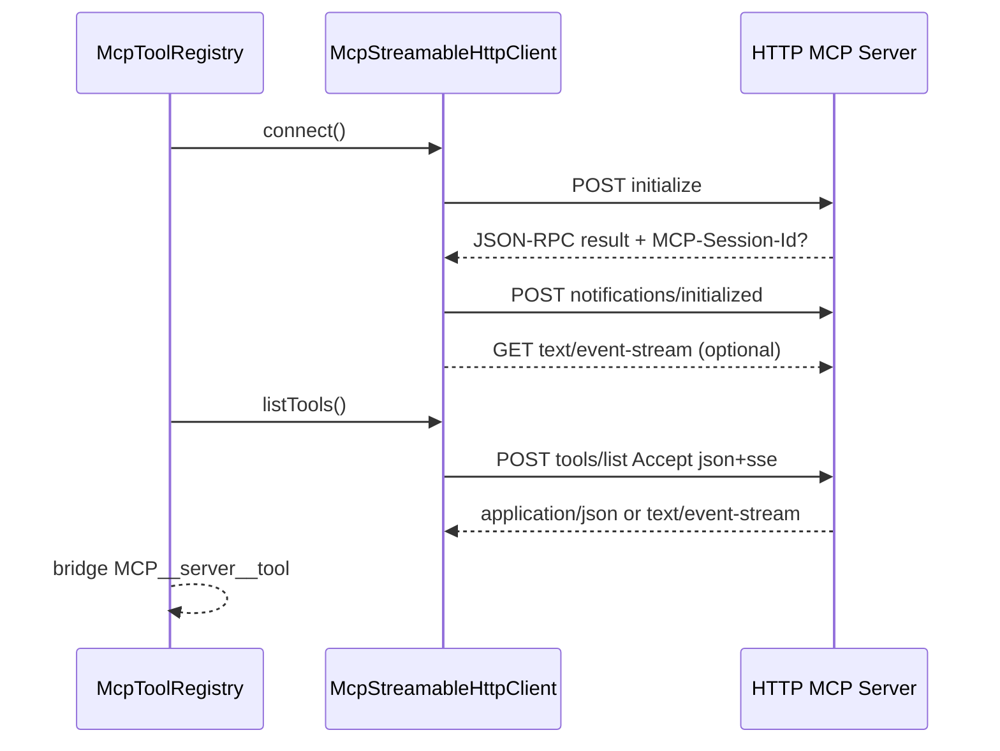
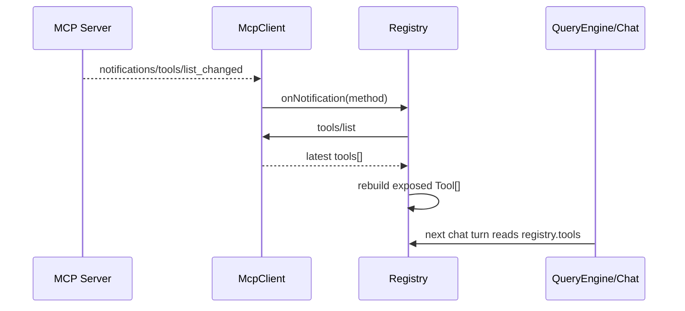

# nova-code 架构文档 · M8.1

> 适用版本：M8.1 完成之后（MCP stdio + Streamable HTTP + tools/list_changed 刷新）
> 基线日期：2026-05-16
> 文档目标：说明 M8.1 对 MCP transport、client abstraction、registry 动态刷新和 chat 集成的改动。

---

## 1. 模块布局

```text
src/services/mcp/
├── types.ts                         MCP config / protocol / client interface
├── protocol.ts                      JSON-RPC parse + MCP result validation
├── environment.ts                   env/header $VAR 展开
├── McpStdioClient.ts                stdio transport client
├── McpStreamableHttpClient.ts       Streamable HTTP transport client
├── mcpToolRegistry.ts               MCP tool bridge + list_changed refresh
├── McpStreamableHttpClient.test.ts
├── McpStdioClient.test.ts
├── mcpToolRegistry.test.ts
└── fixtures/stdioEchoServer.ts      stdio fixture，支持 list_changed 测试

src/commands/McpCommand/
├── McpCommand.ts                    list/add/add-http/remove/tools
└── McpCommand.test.ts
```

---

## 2. Client interface

`types.ts` 新增 `McpClient`，registry 不再依赖具体 transport：

```ts
interface McpClient {
  readonly serverInfo: McpInitializeResult | undefined;
  readonly diagnosticSnippet: string;
  connect(signal?: AbortSignal): Promise<McpInitializeResult>;
  listTools(signal?: AbortSignal): Promise<McpListToolsResult>;
  callTool(name, args, signal?): Promise<McpCallToolResult>;
  onNotification(listener): () => void;
  close(): Promise<void>;
}
```

transport factory：

```ts
if (config.type === "http") return new McpStreamableHttpClient(name, config);
return new McpStdioClient(name, config);
```

---

## 3. Streamable HTTP sequence



HTTP client 关键状态：

- `sessionId`：从 `MCP-Session-Id` response header 保存；
- `negotiatedProtocolVersion`：initialize result 的 protocolVersion；
- `sseTask`：后台 GET SSE notification reader；
- `notificationListeners`：向 registry 分发 notification。

---

## 4. Notification refresh flow



Registry 刷新状态：

- `tools`：每个 server 当前 MCP tool snapshot；
- `refreshPromise`：防止同一 server 并发刷新；
- `refreshAgain`：刷新过程中又收到通知时，再跑一轮；
- `readyForRefresh`：初始 `tools/list` 完成前只记录 dirty，不抢跑刷新。

---

## 5. Chat 动态工具接入

M8 的 chat 是启动时固定工具列表。M8.1 给 `runChatRepl` 增加可选：

```ts
getTools?: () => readonly Tool[];
```

`ChatCommand` 传入：

```ts
getTools: () => [...builtinTools, ...(mcpRegistry?.tools ?? [])]
```

因此：

- slash command 的 compact runtime 使用当前工具列表；
- 每轮 `session.sendTurn()` 使用当前工具列表；
- 已经发出的单轮 LLM 请求不会中途变更 tool schema。

---

## 6. 配置与脱敏

`config.ts` 的 MCP schema 变为 union：

- stdio：`type?: "stdio"` + `command`；
- http：`type: "http"` + `url` + `headers`。

`ConfigCommand` 全量输出会脱敏：

- `mcpServers.*.env.*`；
- `mcpServers.*.headers.*`。

---

## 7. 测试策略

- HTTP client 用 `Bun.serve` 模拟 MCP endpoint，覆盖 JSON response、SSE response、GET SSE notification；
- registry 用 stdio fixture 发送 `notifications/tools/list_changed`，验证 `MCP__fixture__echo2` 动态出现；
- CLI / config / config get 单测覆盖 add-http、URL 校验、header 脱敏。

---

## 8. 交叉引用

- [M8.1 设计文档](../design/M8.1-mcp-http-refresh.md)
- [M8.1 使用手册](../manual/M8.1-usage-guide.md)
- [M8 架构文档](./M8-architecture.md)
- [Roadmap](../roadmap.md)
