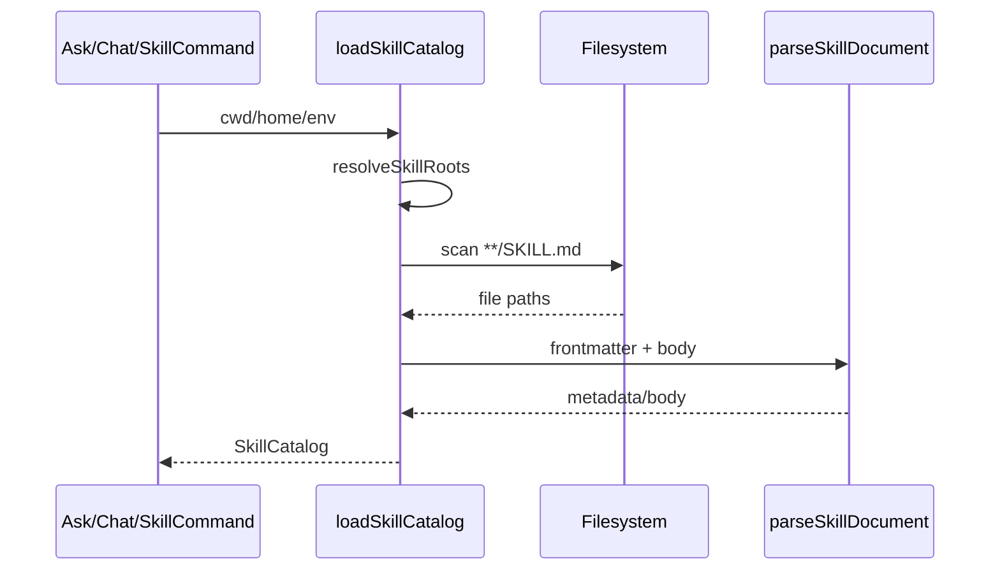
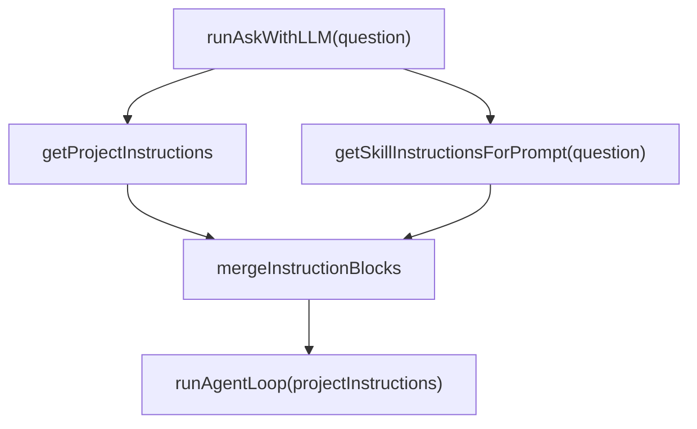
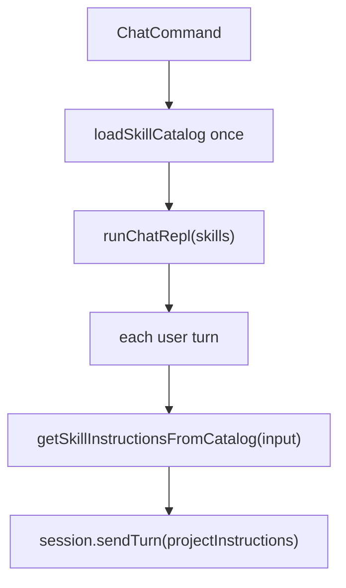

# nova-code 架构文档 · M9

> 适用版本：M9 完成之后（Skills catalog + query 激活 + prompt 注入 + skill CLI）
> 基线日期：2026-05-17
> 文档目标：说明 M9 新增模块、数据流、集成点与测试边界。

---

## 1. 模块布局

```text
src/services/skills/
├── types.ts              LoadedSkill / SkillCatalog / SkillActivation
├── frontmatter.ts        SKILL.md frontmatter 子集解析
├── skillLoader.ts        root 解析 + Bun.Glob 扫描 + SKILL.md 加载
├── skillMatcher.ts       显式触发 + 关键词触发
├── skillPrompt.ts        prompt 格式化 + 长度截断 + mergeInstructionBlocks
├── skillContext.ts       load → select → format 的运行时入口
├── index.ts
└── skills.test.ts

src/commands/SkillCommand/
├── SkillCommand.ts       skill list/show/match
└── SkillCommand.test.ts

src/m9-e2e-skills.test.ts 子进程 ask + mock LLM 注入验证
```

---

## 2. 数据模型

```ts
interface LoadedSkill {
  name: string;
  description: string;
  path: string;
  directory: string;
  body: string;
  metadata: SkillMetadata;
}

interface SkillActivation {
  skill: LoadedSkill;
  reason: "explicit" | "keyword";
  score: number;
  matchedTerms: readonly string[];
}
```

`SkillCatalog` 包含：

- `skills`：已去重、按名称排序的 skill；
- `roots`：实际扫描的 roots；
- `warnings`：不可读、重复、格式非法等非致命问题。

---

## 3. 加载流程



加载策略：

- `NOVA_DISABLE_SKILLS=1` 直接返回空 roots；
- `NOVA_SKILL_DIRS` 存在时覆盖默认 roots；
- 同名 skill 用小写 name 去重，先发现者保留；
- IO 错误不阻断命令，只进入 warnings。

---

## 4. ask/chat 集成

ask：



chat：



为什么复用 `projectInstructions` 字段：

- QueryEngine 已经有“追加到 system prompt 末尾”的稳定通道；
- compact forked-agent 与主循环使用同一套 system prompt 构造逻辑；
- 避免为 M9 改动 Anthropic SDK request shape。

---

## 5. Skill CLI

`SkillCommand` 是纯本地命令，不需要 API key：

- `list`：输出 `name / description / path`；
- `show <name>`：输出元数据与正文；
- `match <query...>`：复用生产 matcher，输出激活原因和 score。

CLI options 在测试中可注入 `cwd/homeDir/env/io`，生产路径默认使用 `process.cwd()` 与当前环境。

---

## 6. 权限与安全边界

M9 不让 skill 获得任何执行特权：

- `allowed-tools` 当前只是 metadata；
- tool call 仍全部进入 M3 permission pipeline；
- skill body 只是 prompt 指令，不会动态注册工具；
- 不读取 `SKILL.md` 以外的任意引用文件，避免技能包扩散加载面。

---

## 7. 测试策略

| 层级 | 文件 | 断言 |
|---|---|---|
| Parser | `skills.test.ts` | block scalar / arrays / metadata |
| Loader | `skills.test.ts` | roots / manual-only / env override |
| Matcher | `skills.test.ts` | manual-only 显式触发、关键词触发 |
| Prompt | `skills.test.ts` | skill block 包含正文 marker |
| CLI | `SkillCommand.test.ts` | list/show/match/错误 action |
| E2E | `m9-e2e-skills.test.ts` | ask 的 mock log systemSnippet 包含 skill |

---

## 8. 交叉引用

- [M9 设计文档](../design/M9-skills.md)
- [M9 使用手册](../manual/M9-usage-guide.md)
- [Roadmap](../roadmap.md)
