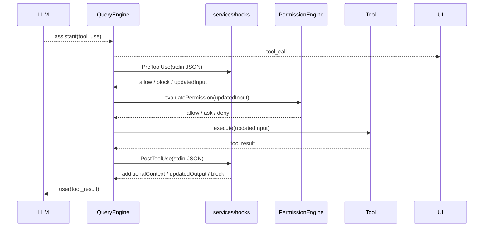

# M10 — Hooks 系统

> 实施日期：2026-05-17
>
> 目标：支持在工具调用前后执行用户配置的脚本，实现 PreToolUse / PostToolUse 拦截、输入改写、阻断与结果改写，为后续更完整的 claude-code hooks 生态打地基。

---

## 1. 设计总览

M10 把 hooks 放在工具生命周期内，而不是做一个独立命令系统：模型产生 `tool_use` 后，QueryEngine 在真正执行工具前后调用 hook runner。



M10 仅落地 command hook 子集：配置中的 `type: "command"` 会通过 Bun 原生 `Bun.spawn` 执行，hook input 以 JSON 写入 stdin。`prompt` / `http` / `agent` / async hooks 留到后续 milestone。

---

## 2. 配置形态

配置放在 `~/.nova-code/config.json` 的 `hooks` 字段，事件名对齐 claude-code：

```json
{
  "hooks": {
    "PreToolUse": [
      {
        "matcher": "Bash|FileEdit",
        "hooks": [
          { "type": "command", "command": "bun run .nova-code/hooks/pre.ts", "timeout": 5 }
        ]
      }
    ],
    "PostToolUse": [
      {
        "matcher": "*",
        "hooks": [
          { "type": "command", "command": "bun run .nova-code/hooks/post.ts" }
        ]
      }
    ]
  }
}
```

Matcher 支持：

- 省略 / `*`：匹配该事件全部工具；
- `Bash`：精确匹配；
- `Bash|FileEdit`：多个精确匹配；
- 其它字符串按正则表达式匹配。

单 hook 支持可选 `if` 条件，例如 `Bash(git *)`。M10 采用轻量实现：先匹配工具名，再用 `*` 通配符匹配 `command` / `path` / `file_path` / `url` / `query` 等常见字段。

---

## 3. Hook stdin / stdout 协议

PreToolUse stdin：

```json
{
  "hook_event_name": "PreToolUse",
  "session_id": "...",
  "cwd": "/repo",
  "tool_name": "Bash",
  "tool_input": { "command": "git status" },
  "tool_use_id": "toolu_..."
}
```

PostToolUse stdin 在此基础上增加：

```json
{
  "tool_response": "...",
  "is_error": false
}
```

退出码语义：

| 退出码 | 语义 |
|---|---|
| `0` | 成功；stdout 可是 JSON 协议，也可为空 / 普通文本 |
| `2` | 阻断；stderr 或 stdout 第一行成为阻断原因 |
| 其它非零 | 非阻断错误；打印 warning，工具调用继续 |

stdout JSON 子集：

```json
{
  "continue": true,
  "decision": "approve",
  "reason": "optional",
  "hookSpecificOutput": {
    "hookEventName": "PreToolUse",
    "updatedInput": { "command": "git status --short" },
    "permissionDecision": "deny",
    "permissionDecisionReason": "policy says no"
  }
}
```

PostToolUse 可返回：

```json
{
  "hookSpecificOutput": {
    "hookEventName": "PostToolUse",
    "updatedOutput": "replacement tool result",
    "additionalContext": "extra context appended to tool result"
  }
}
```

---

## 4. 与权限系统的关系

顺序固定为：

1. `PreToolUse`；
2. M3 permission engine；
3. 工具执行；
4. `PostToolUse`。

原因：PreToolUse 可以做策略化输入改写或更早阻断，permission engine 必须基于最终输入做判断。例如 hook 把 `Bash({ command })` 改成另一条命令后，权限判断会看改写后的 `command`。

PreToolUse 阻断时不会调用权限 provider，也不会执行工具；模型收到 `is_error=true` 的 tool_result。PostToolUse 阻断时工具已经执行完，M10 把返回给模型的 tool_result 改成错误结果。

---

## 5. 与 claude-code 的差异

| 维度 | claude-code | nova-code M10 |
|---|---|---|
| 支持事件 | 多种生命周期事件 | 仅 `PreToolUse` / `PostToolUse` |
| hook 类型 | command / prompt / http / agent / callback / function | 仅 command |
| 执行方式 | Node child_process + ShellCommand 抽象 | Bun 原生 `Bun.spawn` |
| 并发 | 批量 hooks 可并行 | 同一工具的 hooks 串行执行，保证输入/输出改写确定性 |
| async hooks | 支持 | 暂不支持 |
| 配置入口 | settings hooks + UI | `~/.nova-code/config.json` 手写 JSON |

这些偏离是刻意收窄：M10 先锁定安全边界和 QueryEngine 插入点，后续再补更多 hook 类型。

---

## 6. 测试覆盖

| 测试 | 覆盖点 |
|---|---|
| `src/services/hooks/hooks.test.ts` | matcher、`if` 条件、command 执行、阻断、输入/输出改写 |
| `src/QueryEngine.test.ts` | PreToolUse 改写输入、阻断不执行工具、PostToolUse 改写结果 |
| `src/config/config.test.ts` | `hooks` 配置 schema 校验 |
| `src/m10-e2e-hooks.test.ts` | 子进程 ask + mock LLM 触发 PreToolUse/PostToolUse |
| `src/commands/ChatCommand/renderAgentEvent.test.ts` | hook_result UI 渲染 |

---

## 7. 后续预留

- `UserPromptSubmit` / `Stop` / `SessionStart` / compact hooks；
- prompt / http / agent / async hook 类型；
- hooks CLI 或 chat `/hooks` 配置 UI；
- workspace trust / project-local hook 策略；
- hook 执行 trace、耗时统计与 replay。

---

## 8. 交叉引用

- [M10 使用手册](../manual/M10-usage-guide.md)
- [M10 架构文档](../architecture/M10-architecture.md)
- [Roadmap](../roadmap.md)
