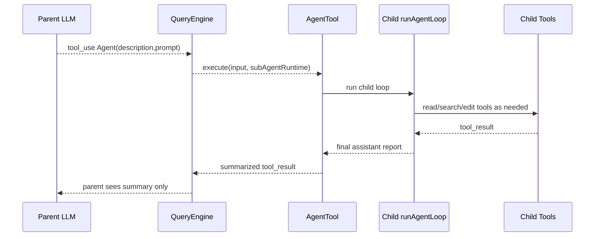

# M11 — AgentTool（子 agent 派生）

> 实施日期：2026-05-17
>
> 目标：让模型可以通过 `Agent` 工具派生一个同步 one-shot 子 agent 执行独立子任务；父 agent 只接收最终摘要，避免把子任务的中间工具噪音灌回主上下文。

---

## 1. 设计总览

M11 把子 agent 做成普通 Tool，而不是新增 CLI 命令或后台任务系统。父 agent 在一次 `tool_use` 中调用 `Agent`，QueryEngine 注入 `SubAgentRuntime`，AgentTool 再启动一个内部 `runAgentLoop`。



关键取舍：M11 是**同步 one-shot**，即父 agent 等待子 agent 完成。异步后台 agent、进度文件、kill/resume、worktree 隔离和多 agent 协作留给后续阶段。

---

## 2. Tool schema

工具名：`Agent`。

输入：

```json
{
  "description": "3-8 word short task label",
  "prompt": "complete briefing for the sub-agent",
  "subagent_type": "general-purpose | explore"
}
```

- `description`：短描述，进入日志 / hook / session id 后缀；限制 120 字符。
- `prompt`：完整任务说明；限制 20,000 字符。
- `subagent_type`：可选；默认 `general-purpose`。
  - `general-purpose`：继承父工具池但移除 `Agent` / `TodoWrite`。
  - `explore`：只给 LS / FileRead / Grep / Glob / WebFetch / WebSearch / Skill，用于只读调研。

输出是普通 `tool_result.content`：

```text
Sub-agent completed (type: explore, turns: 1).

<child final report>
```

摘要最大 30,000 字符，超过会截断并标注。

---

## 3. QueryEngine 集成

`ToolExecutionContext` 新增可选 `subAgentRuntime`：

```ts
interface SubAgentRuntime {
  readonly run: (params: SubAgentRunParams) => Promise<SubAgentRunResult>;
}
```

QueryEngine 在工具执行阶段创建 runtime，并传给所有工具；只有 AgentTool 使用它。这样 AgentTool 不需要 import QueryEngine，避免 `QueryEngine → tools.ts → AgentTool → QueryEngine` 循环依赖。

子 agent 使用同一份：

- `ResolvedConfig` / Anthropic client；
- permission mode/store/provider；
- hooks 配置；
- cwd 与 AbortSignal；
- debug LLM sink。

子 agent 单独创建 auto-compact tracking，以免污染父循环 turn counter。

---

## 4. 上下文策略

M11 不把父 messages 原样作为 child `initialMessages`，原因是父当前 assistant message 里包含 `Agent` tool_use，直接继承容易产生未配对 tool_result 序列。

当前策略：

1. QueryEngine 在执行工具前截取当前 assistant 之前的 parent messages；
2. 格式化最近 24 条消息为纯文本 parent context；
3. 把 parent context 和 AgentTool prompt 合并成子 agent 的单条 user prompt。

这牺牲了部分 prompt-cache 共享，但换来消息序列稳定、实现简单、父上下文不被子 agent 中间结果污染。

---

## 5. 权限与 hooks

执行顺序保持 M10 生命周期：

1. 父层 `PreToolUse(Agent)`；
2. 父层 permission engine 评估 Agent；
3. AgentTool 启动子 agent；
4. 子 agent 内部每个工具继续执行 PreToolUse / permission / PostToolUse；
5. 父层 `PostToolUse(Agent)`。

`Agent.requiresApproval=false`，因为真正有副作用的是子 agent 内部的 FileWrite/FileEdit/Bash/MCP 工具，它们仍会经过既有权限系统。

---

## 6. 与 claude-code 的差异

| 维度 | claude-code | nova-code M11 |
|---|---|---|
| 工具名 | `Agent`，兼容旧 `Task` | 仅 `Agent` |
| agent 类型 | built-in + custom agents | `general-purpose` / `explore` 两个内置轻量类型 |
| 执行模式 | 同步、后台、远程、worktree、teammate 等 | 仅同步 one-shot |
| 上下文继承 | 有 fork/缓存优化路径 | parent context 文本化注入 |
| 进度展示 | UI task/progress | 父 UI 只显示 `[tool] Agent` 和最终父回答 |
| 隔离 | 可 worktree / remote | 当前进程同 cwd；权限系统兜底 |

这些偏离是刻意降维：先验证 QueryEngine 可递归派生、权限/hooks 可复用，再进入异步与隔离。

---

## 7. 测试覆盖

| 测试 | 覆盖点 |
|---|---|
| `src/QueryEngine.test.ts` | AgentTool 派生子 loop、父只收到 summary、子工具池不含 Agent |
| `src/services/api/mockClient.ts` | 新增 `NOVA_MOCK_SCENARIO=agent-loop` |
| `src/m11-e2e-agent.test.ts` | 子进程 `ask` 经 mock LLM 触发 AgentTool |

---

## 8. 后续预留

- 自定义 agent 定义目录（类似 skills 的 `AGENTS.md`/frontmatter）；
- 后台 agent 与 completion notification；
- worktree 隔离；
- 子 agent 进度事件、成本归集、debug transcript；
- 针对 AgentTool 的 permission rule 细分（按 `subagent_type` 或 description）。

---

## 9. 交叉引用

- [M11 使用手册](../manual/M11-usage-guide.md)
- [M11 架构文档](../architecture/M11-architecture.md)
- [Roadmap](../roadmap.md)
