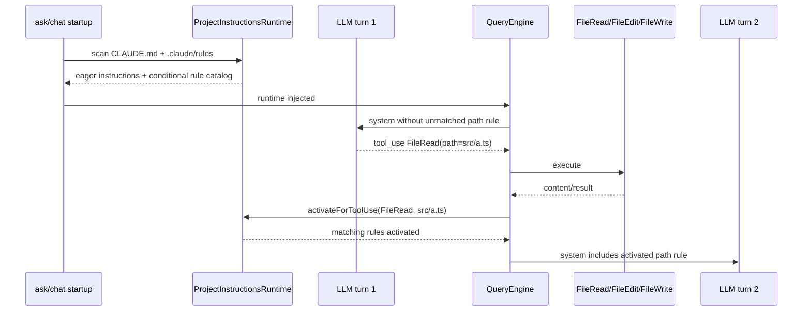

# M12 — `.claude/rules` 逻辑

> 实施日期：2026-05-17
>
> 目标：把 `.claude/rules/**/*.md` 纳入 nova-code 的 project instructions 体系，并支持通过 frontmatter `paths` 做路径级延迟激活。

---

## 1. 设计总览

M12 将 `.claude/rules` 定义为**模型行为指令**，不是 M3 的工具权限规则。它复用 M4 CLAUDE.md 的 `@include`、HTML comment strip 和 system prompt 注入路径，但新增一个运行时状态：无 `paths` 的规则随会话启动 eager load；带 `paths` 的规则在工具处理匹配文件后才进入后续 LLM turn 的 system prompt。



关键取舍：M12 不做 prompt `@file` 解析，用户输入中的 @-mention 与附件触发留给 M14；当前只由 `FileRead` / `FileEdit` / `FileWrite` 的 `path` 字段触发。

---

## 2. Rule 文件格式

规则文件位于任一目录层级的 `.claude/rules/**/*.md`。

### 2.1 eager rule

无 `paths` frontmatter 的规则随 `CLAUDE.md` 一起加载：

```md
# General engineering rule
Prefer small, reviewed changes.
```

也允许存在非 `paths` frontmatter；frontmatter 不进入模型上下文：

```md
---
description: general guidance
---
Prefer small, reviewed changes.
```

### 2.2 path-scoped rule

带 `paths` 的规则只在命中文件路径后激活：

```md
---
paths:
  - "src/**/*.ts"
  - "bin/**/*.ts"
---
Use Bun APIs and strict TypeScript patterns.
```

`paths` 支持字符串、inline array 和 YAML list 子集。匹配使用 `Bun.Glob.match()`，规则路径相对包含 `.claude` 的目录。

---

## 3. 加载顺序与优先级

M12 延续 M4 的“越后加载优先级越高”约定：

1. managed：`/etc/nova-code/CLAUDE.md`（Windows 跳过）
2. user：`~/.nova-code/CLAUDE.md`
3. project：从 git root 到 cwd，每层加载：
   - `CLAUDE.md`
   - `.nova-code/CLAUDE.md`
   - `.claude/rules/**/*.md` 中无 `paths` 的 eager rules
4. local：从 git root 到 cwd，每层加载 `CLAUDE.local.md`
5. activated path rules：从 git root 到 cwd 的 conditional rules，按目录链与文件名排序追加

因此更靠近 cwd 的规则会出现在更后面，模型应按后出现的指令处理冲突。

---

## 4. 与权限规则的边界

| 维度 | `.claude/rules/*.md` | `.nova-code/permissions.json` |
|---|---|---|
| 目的 | 指导模型如何写/读/组织代码 | 决定工具调用是否允许/询问/拒绝 |
| 生效位置 | system prompt | QueryEngine permission pipeline |
| 格式 | Markdown + optional frontmatter | JSON rule list |
| `paths` 含义 | 选择何时把指令展示给模型 | 不参与权限 |
| 可阻断工具 | 否 | 是 |

这一区分避免“规则文件看起来像安全策略但实际只影响模型行为”的误用。

---

## 5. Hooks 对齐

M12 扩展 M10 hook 事件：`InstructionsLoaded`。

stdin JSON 子集：

```json
{
  "hook_event_name": "InstructionsLoaded",
  "session_id": "ask",
  "cwd": "/repo",
  "file_path": "/repo/.claude/rules/typescript.md",
  "memory_type": "Project",
  "load_reason": "path_glob_match",
  "globs": ["src/**/*.ts"],
  "trigger_file_path": "/repo/src/a.ts"
}
```

`InstructionsLoaded` 是 audit/observability hook：nova-code 会执行 command hook，但不会把 hook 输出作为模型上下文，也不会用它阻断指令加载。

---

## 6. 测试覆盖

| 测试 | 覆盖点 |
|---|---|
| `src/services/projectInstructions/claudeMd.test.ts` | eager rules、frontmatter strip、HTML comment strip、conditional activation、目录链优先级 |
| `src/QueryEngine.test.ts` | FileRead 命中后下一轮 system prompt 注入 path-scoped rule |
| `src/m12-e2e-rules.test.ts` | 子进程 `nova-code ask` + mock LLM 验证首轮无污染、次轮注入 |
| 既有 M4/M9/M10/M11 e2e | 回归 CLAUDE.md、skills、hooks、AgentTool 集成 |

---

## 7. 后续预留

- M14：prompt attachments 与 `@file` 命中时触发对应 path-scoped rules。
- M13：插件可贡献 instruction fragments / rules。
- 更完整 YAML 解析与 glob 否定语义；当前只实现项目实际需要的 `paths` 子集。
- UI/debug 中展示“本轮激活了哪些 rules”的可观测事件。

---

## 8. 交叉引用

- [M12 使用手册](../manual/M12-usage-guide.md)
- [M12 架构文档](../architecture/M12-architecture.md)
- [Roadmap](../roadmap.md)
