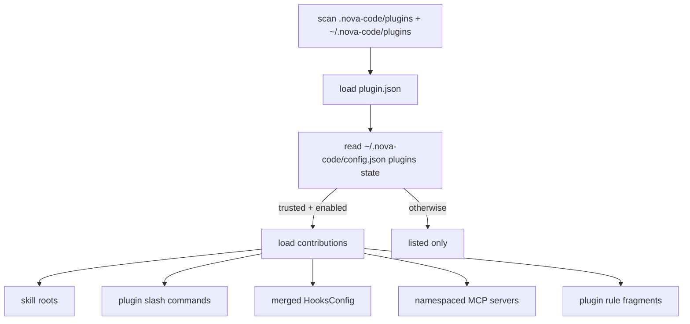

# M13 — 插件系统

> 实施日期：2026-05-18
>
> 目标：把 skills、custom slash commands、hooks、MCP servers 与 rules 统一纳入本地插件包，让插件成为既有扩展点的“打包层”，而不是重写各子系统。

---

## 1. 设计总览

M13 引入本地插件目录：

- 项目级：`<cwd>/.nova-code/plugins/<plugin>/plugin.json`
- 用户级：`~/.nova-code/plugins/<plugin>/plugin.json`

插件默认**只发现、不生效**。用户必须执行 `nova-code plugin enable <name> --yes`，确认信任后才会贡献运行时能力；`disable` 后所有贡献项从 ask/chat/skill/runtime 中消失。



---

## 2. Manifest 格式

最小 manifest：

```json
{
  "name": "demo",
  "version": "1.0.0",
  "description": "Demo plugin"
}
```

支持字段：

| 字段 | 类型 | 默认约定 |
|---|---|---|
| `name` | string | 必填，`[A-Za-z0-9_-]+` |
| `version` | string | 可选，展示与状态记录 |
| `description` | string | 可选，`plugin list` 展示 |
| `skills` | string 或 string[] | 额外 skill root；默认还会扫描 `skills/` |
| `commands` | string 或 string[] | 额外 markdown command 路径；默认还会扫描 `commands/` |
| `hooks` | HooksConfig、`.json` 路径或数组 | 默认还会读取 `hooks/hooks.json` |
| `mcpServers` | McpServersConfig、`.json` 路径或数组 | 默认还会读取 `mcp.json` / `.mcp.json` |
| `rules` | string 或 string[] | 额外 rules 文件/目录；默认还会扫描 `rules/` 与 `.claude/rules/` |

路径必须相对插件根目录，不允许绝对路径，也不允许任何 `..` 段（按 `/` 分段判断，所以 `foo..bar.md` 这类合法文件名不会被误拒）。

`hooks` / `mcpServers` 可以是 inline 对象、相对路径字符串，或它们的数组；数组中混入既不是字符串也不是对象的元素会直接报错而非静默忽略，便于发现 manifest typo。

---

## 3. 贡献项设计

### 3.1 Skills

插件的 `skills/<skill-name>/SKILL.md` 会作为额外 skill root 注入 M9 `loadSkillCatalog()`。现有 Skill tool、skill listing、用户 `/skill-name` 展开逻辑不需要重写。

冲突策略：常规 project/user skill root 先加载，插件 skill 后加载；同名 skill 仍走 M9 duplicate skip 规则。

### 3.2 Custom slash commands

插件 `commands/**/*.md` 会生成命名空间命令：

```text
commands/review.md       => /demo:review
commands/java/audit.md   => /demo:java:audit
```

ask/chat 在识别到插件命令时本地展开 markdown body，形成本轮 user prompt；`$ARGUMENTS` 会替换为用户传入参数。这样 custom slash command 只是一种 prompt packaging，不绕过权限系统。

### 3.3 Hooks

插件 hooks 复用 M10 `HooksConfig` schema，并在 ask/chat 启动时与用户配置 hooks 合并。插件 hook 命令支持变量替换：

```json
{
  "PostToolUse": [
    {
      "matcher": "FileRead",
      "hooks": [{ "type": "command", "command": "bun ${NOVA_PLUGIN_ROOT}/hook.ts" }]
    }
  ]
}
```

合并顺序：用户配置 hooks 在前，插件 hooks 在后。禁用插件后其 hooks 不再进入合并结果。

### 3.4 MCP server templates

插件 MCP 配置复用 M8 `McpServersConfig`。为了避免与用户手写 server 冲突，运行时 server name 会加命名空间：`<plugin>_<server>`，暴露工具名仍沿用 `MCP__server__tool`。

stdio MCP server 未显式配置 `cwd` 时，默认以插件根目录为 `cwd`，便于 `args: ["./server.ts"]` 这类插件内脚本。

### 3.5 Rules / instruction fragments

插件 `rules/**/*.md` 复用 M12 `.claude/rules` 解析器：

- 无 `paths` 的 rule：启动即加载。
- 带 `paths` 的 rule：文件工具命中后下一轮注入。

插件 rule 的 `paths` 匹配基准是当前工作目录 `cwd`，不是插件目录；这样插件可以声明“当用户读 `src/**/*.ts` 时应用我的 TypeScript 指令”。

---

## 4. 信任与状态

状态写在 `~/.nova-code/config.json` 的 `plugins` 字段：

```json
{
  "plugins": {
    "demo": {
      "enabled": true,
      "trusted": true,
      "version": "1.0.0",
      "path": "/Users/me/proj/.nova-code/plugins/demo",
      "lastReloadedAt": "2026-05-18T00:00:00.000Z"
    }
  }
}
```

`enable --yes` 时把当前 plugin 的绝对路径与 manifest version 一起写入，作为下次启动时的"信任锚"。

**漂移降级**：

- `state.path` 存在但与本次发现的绝对路径不同 → `path-changed`，降级为 untrusted。
  防止全局信任的 `demo` 名字在另一个项目里直接被复用。
- `state.path` 缺失 → 走旧版宽松模式，保持向后兼容（已有 trust 状态文件不会被一刀切作废）。
- `state.version` 与 `manifest.version` 都存在且不相等 → `version-changed`，降级为 untrusted。
  作者推送新版本（含新 hook 命令等）后强制用户复审。

降级后 `loadPluginCatalog` 会把降级原因加入 warnings，并提示用户重跑 `plugin enable <name> --yes`。

启用未信任插件必须显式 `--yes`。当前版本不做 marketplace、签名、远程安装或自动更新；M13 只交付本地插件包与运行时合并层。

**已知限制**：版本字段由插件作者自己维护，作者若不升 version 也能改 hook 命令。漂移检测只能拦"诚实但更新"的作者，不能阻止恶意作者；后续 milestone 可考虑对 hook/MCP/skill 文件做内容哈希。

---

## 5. 与 claude-code 的差异

| 维度 | claude-code | nova-code M13 |
|---|---|---|
| 插件来源 | marketplace / builtin / local 等多来源 | 仅本地目录 |
| UI | TUI plugin management | headless CLI `nova-code plugin ...` |
| manifest | `.claude-plugin/plugin.json` 生态完整 schema | `plugin.json`，并兼容 `.nova-code-plugin/plugin.json` |
| trust | 更复杂的 marketplace policy | 本地 `--yes` 信任门禁 |
| 输出样式/agent/LSP | 已有更多组件 | 本阶段只接入 roadmap 要求的五类贡献项 |

---

## 6. 测试覆盖

| 测试 | 覆盖点 |
|---|---|
| `src/services/plugins/plugins.test.ts` | 发现、信任/启用、禁用后贡献项消失、变量替换、MCP 命名空间 |
| `src/commands/PluginCommand/PluginCommand.test.ts` | `list/validate/enable/disable/reload` 状态写入 |
| `src/m13-e2e-plugins.test.ts` | 子进程 ask 验证 plugin skill listing、slash command、本地 hook、path-scoped rule |
| 既有 M8/M9/M10/M12 e2e | 回归 MCP、skills、hooks、rules 子系统未被插件层破坏 |

---

## 7. 后续预留

- Marketplace / remote install / version pinning。
- Plugin user config 与敏感配置存储。
- 更完整 manifest schema：object mapping commands、dependency graph、agent/output-style/LSP。
- TUI 中展示插件命令与贡献项来源。

---

## 8. 交叉引用

- [M13 使用手册](../manual/M13-usage-guide.md)
- [M13 架构文档](../architecture/M13-architecture.md)
- [Roadmap](../roadmap.md)
