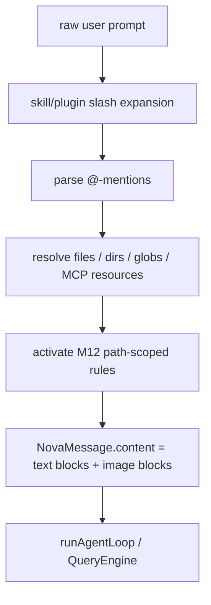

# M14 — Prompt 附件与 @-mention 上下文注入

> 实施日期：2026-05-19
>
> 目标：把用户输入从纯文本升级为 `prompt + attachments`，让 ask/chat 在首轮 LLM 请求前解析 `@file` / `@dir` / `@glob` / `@MCP__server__resource`，注入结构化上下文，并同步激活 M12 path-scoped rules。

---

## 1. 设计总览

M14 在 ask/headless 与 chat/REPL 的共同入口前增加 `AttachmentResolver`：



关键取舍：M14 不把附件做成工具调用，也不等待模型主动 `FileRead`。用户显式写 `@src/cli.ts` 时，文件内容在**第一轮**请求中已作为 user message content block 出现；匹配的 `.claude/rules` 也在第一轮 system prompt 中可见。

---

## 2. 支持的 @-mention 语法

| 语法 | 解析结果 |
|---|---|
| `@src/cli.ts` | 自动 stat；文件按 file、目录按 directory、含 glob magic 按 glob |
| `@file:src/cli.ts` / `@file(src/cli.ts)` | 强制文件附件 |
| `@dir:src` / `@dir(src)` | 强制目录摘要 |
| `@glob:src/**/*.ts` / `@glob(src/**/*.ts)` / `@src/**/*.ts` | glob 匹配文件并读取前 N 个 |
| `@MCP__docs__doc://intro` | 读取 MCP server `docs` 的 resource URI `doc://intro` |

解析器采用轻量扫描：只有行首或空白/常见分隔符后的 `@` 会触发，避免把邮箱地址误判成附件。bare path 仍保留原 prompt 文本；附件内容作为附加 content blocks 注入，所以模型既看到用户原话，也看到解析后的上下文。

---

## 3. 附件注入模型

M14 扩展 `NovaContentBlock`：

```ts
type NovaContentBlock = TextBlock | ImageBlock | ToolUseBlock | ToolResultBlock;
```

解析后 user message 形如：

1. 原始 prompt text block。
2. `<attachments_summary>` text block，列出去重后的附件。
3. 每个文本附件一个 text block：文件内容、目录摘要、glob 摘要、MCP resource 内容。
4. 图片文件一个 label text block + `image` block（base64 source）。

文本附件单个读取上限为 64KB / 24K chars；glob 默认最多注入 20 个匹配文件；目录摘要最多 120 个直接子项；图片最大 5MB。超限时保留摘要并标记 `[truncated]` 或 warning，避免单轮 prompt 不受控膨胀。

---

## 4. M12 Rules 联动

`ProjectInstructionsRuntime` 新增 `activateForPath({ path, cwd })`，供附件 resolver 在首轮 LLM 请求前直接激活 path-scoped rules。

激活与否完全由 attachment 的 `referencedFilePaths` 决定，resolver 不解析 rule frontmatter。各 kind 的策略：

| Attachment kind | `referencedFilePaths` | 触发 rules |
|---|---|---|
| `FILE`（文本文件） | 该文件绝对路径 | ✅ |
| `DIRECTORY` | 目录直接子项中**只是 file 的项**（不递归） | ✅（按子文件路径分别激活） |
| `GLOB` | 命中文件去重后的前 N 个绝对路径 | ✅ |
| `IMAGE` | 空数组 | ❌（图片不参与代码 path-glob） |
| `MCP_RESOURCE` | 空数组 | ❌（MCP URI 与文件系统脱钩） |
| `PASTE_TEXT` | 空数组 | ❌ |

这解决了 M12 的已知边界：只在 prompt 中写 `@src/a.ts` 时，过去不会触发 `paths: ["src/**/*.ts"]`；M14 后第一轮 system prompt 已包含对应 rule。

**安全约束**：

- 裸 `@~` 直接拒绝（避免一行字 dump 整个 home）；用户必须显式写 `@~/some/path`。
- `@glob:/abs/...` 与 `@glob:~/...` 拒绝，因为 glob 引擎只在 cwd 内扫描；想跨目录请改用 `@dir:` 或多个 `@file:`。
- 二进制文件（按 head 4KB 内的 NUL byte 探测）只输出 `[binary file omitted]` 占位，不把字节流塞进 prompt。
- 文件读取 32KB 字节预算 → 24K 字符截断；UTF-8 多字节边界用 `TextDecoder({fatal:false})` 兜底，不抛错。
- `Bun.Glob.scan` 命中 500 项即停，避免 `**/*` 在大仓里走完。

---

## 5. MCP resource 桥接

M8 MCP registry 原本只暴露 `tools/list` / `tools/call`。M14 增加：

- `McpClient.readResource(uri)` → JSON-RPC `resources/read`
- `McpToolRegistry.readResource(serverName, uri)` → 按原始或 sanitize 后 server name 查找连接
- `@MCP__server__resource` → resolver 调 registry 并格式化 resource contents

MCP resource 当前以文本附件形式注入；`blob` 内容仅保留 MIME 与 base64 长度摘要。后续 TUI 可以在同一数据模型上扩展富媒体展示。

**Compact 与图片**：含图片附件的会话触发 auto-compact / `/compact` 时，`compact.ts` 与 `partialCompact.ts` 把 image block 替换成 `[image attachment elided for compact: ...]` 文本占位，避免 base64 在每次 compact 调用中再发一遍（双倍 token 计费）。摘要里仍保留"出现过图片"的提示，符合 compact 的语义。

---

## 6. 与 claude-code 的差异

| 维度 | claude-code | nova-code M14 |
|---|---|---|
| 输入 UI | TUI PromptInput / paste queue / IDE selection | headless ask + readline chat，共用 resolver |
| 附件种类 | 更完整的 IDE、diagnostics、tasks、paste/image 管道 | 文件、目录、glob、MCP resource；paste text/image 先保留最小类型模型 |
| 注入时机 | processUserInput 体系内统一生成 messages | ask/chat slash expansion 后、runAgentLoop 前 |
| rules 联动 | 与 managed memory / rules 深度耦合 | 通过 `activateForPath` 明确桥接 M12 runtime |

---

## 7. 测试覆盖

| 测试 | 覆盖点 |
|---|---|
| `src/services/attachments/attachments.test.ts` | parser、文件/目录/glob/image/MCP resolver、去重、rules 首轮激活 |
| `src/QueryEngine.test.ts` | `userMessageContent` 结构化 content 被透传到 SDK request |
| `src/services/mcp/*Client.test.ts` / `mcpToolRegistry.test.ts` | `resources/read` 桥接 |
| `src/m14-e2e-attachments.test.ts` | 子进程 ask 验证 `@file` 内容与 path-scoped rule 第一轮可见 |
| 全量 `bun test` | 回归 M2 chat、M4 compact、M8 MCP、M12 rules、M13 plugins |

---

## 8. 后续预留

- M17 TUI：把 paste image / paste text 真正接到 UI 队列，复用 M14 `extraAttachments` 模型。
- 更精细的附件 budget：按总 token budget 分配，而不是固定 per-attachment 上限。
- MCP `blob` 图片/音频渲染与多模态 provider 差异处理。
- 目录递归摘要、gitignore-aware glob 策略、附件 cache。

---

## 9. 交叉引用

- [M14 使用手册](../manual/M14-usage-guide.md)
- [M14 架构文档](../architecture/M14-architecture.md)
- [Roadmap](../roadmap.md)
