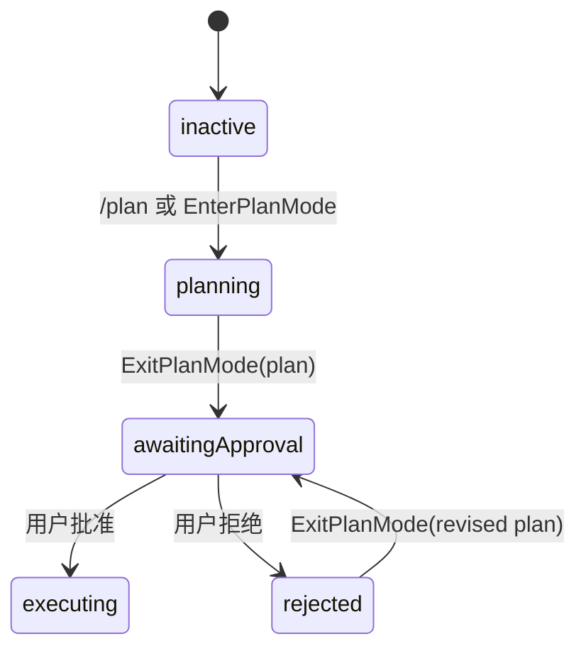

# M15 — Plan Mode 作为一等运行模式

> 实施日期：2026-05-24
>
> 目标：把 `plan` 从权限模式占位升级为完整运行状态：先探索与产出计划，再经用户审批，最后按批准计划执行。

---

## 1. 设计总览

M15 在 QueryEngine 外侧引入会话级 `PlanModeRuntime`，在工具执行链路里引入 `EnterPlanMode` / `ExitPlanMode` 两个模型可调用工具，并在 chat REPL 增加 `/plan` 入口。



核心原则：Plan Mode 不是单纯 prompt 文案，而是权限系统前置约束。只要状态仍处于 `planning` / `awaitingApproval` / `rejected`，`Bash` / `FileWrite` / `FileEdit` 都会被拦截；批准后恢复进入 Plan Mode 前的权限模式。

---

## 2. 新增模块

| 模块 | 职责 |
|---|---|
| `src/services/plan/types.ts` | Plan Mode 状态、审批 provider、runtime 接口 |
| `src/services/plan/planModeRuntime.ts` | 状态机实现、权限模式恢复、system prompt 注入 |
| `src/services/plan/prompt.ts` | planning / approved plan 两类 system instructions |
| `src/services/plan/interactivePlanApprovalProvider.ts` | chat REPL 中的 plan 审批交互 |
| `src/tools/EnterPlanModeTool/` | 模型主动进入 Plan Mode |
| `src/tools/ExitPlanModeTool/` | 模型提交 plan 并请求用户审批 |
| `src/commands/ChatCommand/slash/plan.ts` | 用户 `/plan` slash command |

`PlanModeRuntime` 被注入到 `runAgentLoop`、`ToolExecutionContext`、`ChatSession.sendTurn()`；这样工具、权限、system prompt 都读同一个状态源。

---

## 3. 权限语义

M15 修改 `evaluatePermission()`：在 DENY_PATTERNS 之后、`bypassPermissions` 与用户 allow 规则之前增加 Plan Mode 拦截。

| 状态 | `Bash` | `FileWrite` / `FileEdit` | 只读工具 |
|---|---|---|---|
| `planning` | deny | deny | allow/按原规则 |
| `awaitingApproval` | deny | deny | allow/按原规则 |
| `rejected` | deny | deny | allow/按原规则 |
| `executing` | 恢复进入前模式 | 恢复进入前模式 | 恢复进入前模式 |

这意味着即便用户以 `--dangerously-skip-permissions` 启动 chat，只要进入 Plan Mode，批准前仍不能执行 Bash / 写文件；批准后才恢复 bypass 行为。

---

## 4. Plan summary 与执行约束

`ExitPlanMode({ plan })` 的成功 tool_result 会进入会话历史；同时 `PlanModeRuntime.getSystemInstructions()` 在执行阶段追加：

```text
<approved_plan>
The user approved the following plan...
...
</approved_plan>
```

执行阶段模型既能从历史看到审批结果，也会在每轮 system prompt 中看到 approved plan 作为硬约束。若用户拒绝，runtime 保持 Plan Mode 并把拒绝信息注入后续 planning prompt。

---

## 5. Chat / ask 差异

- `chat`：`/plan [prompt]` 进入 Plan Mode；`ExitPlanMode` 通过交互式 provider 展示计划并读取 `y/yes` 审批。
- `ask`：同样注入 `PlanModeRuntime`，但没有交互式审批 provider；模型若调用 `ExitPlanMode` 会得到 rejected 结果，避免 headless 任务卡住等待输入。

`/plan <prompt>` 会先切换到 Plan Mode，再把 `<prompt>` 作为当前 turn 继续提交给模型；`/plan` 无参数只切换状态。

---

## 6. 与 M11 子 agent 协作

M15 给 `Agent` 工具新增 `subagent_type: "plan"`：

- `explore` / `plan` 子 agent 只获得 `LS` / `FileRead` / `Grep` / `Glob` / `WebFetch` / `WebSearch` / `Skill` 等只读工具。
- `plan` 子 agent 的 system hint 要求输出实现计划，但禁止修改文件或运行 mutating commands。
- 父 agent 若处于 Plan Mode，子 agent 复用同一个 `PlanModeRuntime`，因此即便选择 general-purpose 也会受 Plan Mode 写权拦截保护。

---

## 7. 与 claude-code 的差异

| 维度 | claude-code | nova-code M15 |
|---|---|---|
| Plan 存储 | TUI + plan file 流程 | `ExitPlanMode(plan)` 直接提交计划文本 |
| 审批 UI | React/Ink permission dialog | readline REPL `y/n` 审批 |
| 状态源 | AppState toolPermissionContext | `PlanModeRuntime` 注入 QueryEngine |
| 子 agent | 更完整 teammate / swarm 协议 | 轻量 `plan` subagent type + 只读工具集 |
| headless | 复杂远程/渠道处理 | 无审批 provider 时自动 rejected，避免阻塞 |

当前实现目标是 Plan Mode 的核心执行语义，而不是 claude-code 的 plan file / remote teammate 全量 UI。

---

## 8. 测试覆盖

| 测试 | 覆盖点 |
|---|---|
| `src/services/plan/planModeRuntime.test.ts` | 状态机、批准/拒绝、system instructions |
| `src/QueryEngine.test.ts` | plan 权限拦截、ExitPlanMode 获批后恢复执行 |
| `src/commands/ChatCommand/slash/plan.test.ts` | `/plan` slash 状态切换与 prompt 提交 |
| `src/m15-e2e-plan-mode.test.ts` | chat 子进程 `/plan` → ExitPlanMode → 批准 → FileWrite |
| 全量 `bun test` | 旧权限、hooks、MCP、skills、attachments 回归 |

---

## 9. 后续预留

- M17 TUI 可复用 `PlanModeRuntime`，把 `interactivePlanApprovalProvider` 替换为富交互审批面板。
- M18 resume 时可把 Plan Mode snapshot 纳入 session meta，恢复未完成 planning 状态。
- Phase 3 的 Plan-Execute-Verify 自治 loop 可在 approved plan 之上增加验证阶段，不需要重写 M15 状态机。

---

## 10. 交叉引用

- [M15 使用手册](../manual/M15-usage-guide.md)
- [M15 架构文档](../architecture/M15-architecture.md)
- [Roadmap](../roadmap.md)
