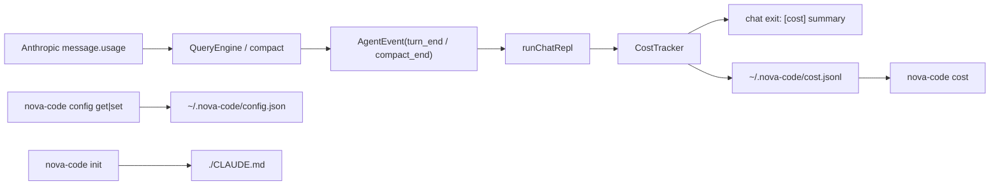

# M5 — Cost、Config CLI、init

> 实施日期：2026-05-14
>
> 目标：补齐 daily driver 必需的三个小能力：`nova-code cost`、`nova-code config get|set`、`nova-code init`；并在 chat 结束时打印 token 消耗与估算费用。

---

## 1. 设计总览

M5 是一个横向补齐阶段，不改 agent loop 核心策略，只在三条边界上落地：



### 1.1 对齐 claude-code 的点

| 维度 | claude-code | nova-code M5 |
|---|---|---|
| cost tracker | `cost-tracker.ts` 累计 input/output/cache read/cache write + USD | **同款核心字段**，落在 `src/services/cost/CostTracker.ts` |
| 价格计算 | `utils/modelCost.ts` 静态模型档位，每百万 token 单价 | **同款档位表**，落在 `src/services/cost/pricing.ts` |
| `/cost` | TUI/local command 读取当前 session 内存状态 | 独立 CLI 命令读取 `~/.nova-code/cost.jsonl` 历史 ledger |
| config | React settings panel | CLI-first：`config get|set` 读写 `~/.nova-code/config.json` |
| init | prompt command 让模型分析仓库生成 CLAUDE.md | CLI-first：生成一份最小 CLAUDE.md 模板；智能分析留给后续 agent 化 `/init` |

### 1.2 明确差异

`nova-code cost` 与 claude-code `/cost` 最大差异是**进程边界**：nova-code 的 `cost` 是普通子命令，启动时拿不到上一个 `chat` 进程的内存，因此 M5 引入了 `~/.nova-code/cost.jsonl` ledger。chat 结束后以 best-effort 追加一条 session summary；`nova-code cost` 汇总这些条目。

---

## 2. Cost tracker 设计

### 2.1 数据来源

M4 已经把 Anthropic SDK 的 usage 最小子集挂到 assistant message：

```ts
interface ApiUsage {
  readonly input_tokens: number;
  readonly cache_creation_input_tokens?: number | null;
  readonly cache_read_input_tokens?: number | null;
  readonly output_tokens: number;
}
```

M5 不重新数 token，而是直接复用这个真实 usage：

- 普通 LLM turn：`AgentEvent.type === "turn_end"`，从 `event.message.usage` 记录。
- 自动 compact：`compactConversation` 返回 `compactionUsage`，`QueryEngine.tryAutoCompact` 放进 `compact_end.usage`，REPL 记录。
- 手动 `/compact`：`ChatSession.compact()` 返回 `compactionUsage`，slash command 直接记到注入的 `CostTracker`。

### 2.2 费用估算

`src/services/cost/pricing.ts` 内置 M5 静态快照：

| 档位 | input / Mtok | output / Mtok | cache write / Mtok | cache read / Mtok | 覆盖模型 |
|---|---:|---:|---:|---:|---|
| `COST_TIER_3_15` | $3 | $15 | $3.75 | $0.30 | Sonnet 3.5/3.7/4.x |
| `COST_TIER_15_75` | $15 | $75 | $18.75 | $1.50 | Opus 4 / 4.1 |
| `COST_TIER_5_25` | $5 | $25 | $6.25 | $0.50 | Opus 4.5+ |
| `COST_HAIKU_35` | $0.80 | $4 | $1 | $0.08 | Haiku 3.5 |
| `COST_HAIKU_45` | $1 | $5 | $1.25 | $0.10 | Haiku 4.5 |

计算公式：

```text
cost = input_tokens / 1e6 * input_rate
     + output_tokens / 1e6 * output_rate
     + cache_creation_input_tokens / 1e6 * cache_write_rate
     + cache_read_input_tokens / 1e6 * cache_read_rate
```

价格来源参考 [Anthropic Pricing](https://platform.claude.com/docs/en/about-claude/pricing)。M5 使用 5-minute prompt cache write/read 档位；如果未来要支持 1-hour cache write，需要把 `ApiUsage` 扩展出 cache TTL 维度或在 request 侧记录 cache_control 元数据。

### 2.3 Unknown model 策略

模型名通过 substring rule 匹配，支持 `claude-sonnet-4-5-20250929` 这类带日期后缀的 model id。无法识别时：

1. 回退到 Sonnet 4.x 档位；
2. `CostSnapshot.usedFallbackPricing = true`；
3. 输出追加 `(unknown model pricing fallback applied)`。

这样比直接记 0 更安全：用户至少能看到保守估算和 fallback 提示。

---

## 3. CLI 设计

### 3.1 `nova-code cost`

```bash
nova-code cost
nova-code cost --json
```

- 默认读 `~/.nova-code/cost.jsonl`，文件不存在时显示 0 usage。
- 普通输出复用 `formatCostSummary(snapshot)`。
- `--json` 输出 `{ entries, snapshot }`，方便脚本消费。

### 3.2 `nova-code config get|set`

```bash
nova-code config get
nova-code config get model
nova-code config set model claude-haiku-4-5
nova-code config set maxTokens 4096
```

支持 key：`apiKey` / `baseURL` / `model` / `maxTokens` / `maxTurns`。

设计取舍：

- `config get` 读取**持久化配置**，不解析 env override；`loadConfig()` 仍然保持 env > file > default。
- `apiKey` 输出永远脱敏（`****tail4`）。
- `maxTokens` / `maxTurns` 必须是正整数。
- 不做 `unset`，避免 M5 scope 膨胀；后续可补 `config unset <key>`。

### 3.3 `nova-code init`

```bash
nova-code init
nova-code init --force
```

生成当前目录的 `CLAUDE.md`。已存在时默认拒绝覆盖；`--force` 明确覆盖。

M5 的 `init` 是**最小模板生成器**，不做代码库扫描、不调用 LLM。原因：真正同款 claude-code `/init` 需要 prompt command、AskUserQuestion、子 agent 探测、skills/hooks 提案等能力，已超出 M5；当前先给用户一个可编辑入口，满足“生成 CLAUDE.md”的 DoD。

---

## 4. 代码组织

```text
src/services/cost/
├── pricing.ts              模型价格表 + calculateUsageCostUsd
├── CostTracker.ts          CostTracker / CostSnapshot / formatCostSummary
├── ledger.ts               ~/.nova-code/cost.jsonl append/read/summarize
├── index.ts                公共导出
└── CostTracker.test.ts

src/commands/CostCommand/
├── CostCommand.ts          nova-code cost [--json]
└── CostCommand.test.ts

src/commands/ConfigCommand/
├── ConfigCommand.ts        nova-code config get|set
└── ConfigCommand.test.ts

src/commands/InitCommand/
├── InitCommand.ts          nova-code init [--force]
└── InitCommand.test.ts

src/m5-e2e-cost.test.ts     chat 结束打印 [cost] + ledger 落盘
```

集成点：

- `src/config/config.ts`：新增 `getCostLedgerPath()`。
- `src/commands.ts`：注册 `cost` / `config` / `init`。
- `src/commands/ChatCommand/runChatRepl.ts`：注入 `CostTracker`，监听 `turn_end` / `compact_end`。
- `src/commands/ChatCommand/ChatCommand.ts`：chat 结束后 best-effort 写 ledger。
- `src/types/message.ts`：`compact_end` 新增可选 `usage?: ApiUsage`。

---

## 5. 向后兼容

- `CostTracker` 是可选注入；不传时 `runChatRepl` 行为与 M4 一致。
- `compact_end.usage` 是可选字段；已有事件消费者无需修改。
- `config get|set` 只新增命令，不改变 `loadConfig()` 的优先级。
- cost ledger 写入失败不影响 chat 的退出码，只在 stderr 打 `[cost] failed to write ledger: ...`。
- session JSONL 不迁移；cost ledger 是独立文件。

---

## 6. 测试覆盖

| 模块 | 覆盖点 |
|---|---|
| `pricing.ts` | 带日期后缀模型匹配；Sonnet 4.5 input/output/cache 公式 |
| `CostTracker.ts` | 多次 usage 累计；格式化摘要 |
| `ledger.ts` | append/read/summarize；注入临时 home |
| `CostCommand.ts` | 空 ledger 输出 0；`--json` 汇总 |
| `ConfigCommand.ts` | set/get；apiKey 脱敏；正整数校验 |
| `InitCommand.ts` | 创建 CLAUDE.md；拒绝覆盖；`--force` 覆盖 |
| `m5-e2e-cost` | mock chat 一轮后 stderr 包含 `[cost]`；`~/.nova-code/cost.jsonl` 有 entry |

当前全量：616 tests 全绿。

---

## 7. 后续预留

- `config unset` / `config list --effective`：区分 persisted 与 env override。
- `cost --since` / `cost --session`：按时间或 session 过滤 ledger。
- ask 命令 cost ledger：M5 DoD 只要求 chat；ask 可后续复用同一 tracker。
- 1-hour prompt cache pricing：需要 request 侧保存 cache TTL。
- 真正 agent 化 `/init`：等 prompt command、子 agent、skills/hooks 基础设施齐备后再做。
