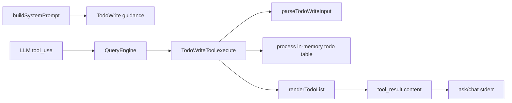

# M6 — TodoWrite 工具

> 实施日期：2026-05-14
>
> 目标：新增与 claude-code `TodoWriteTool` 同形的任务规划工具，让模型在跨文件 / 多步骤任务开始时主动维护 todo list，并在 CLI 中以 ASCII 形式可见。

---

## 1. 设计总览

M6 在 M1 工具系统之上新增第 8 个内置工具：`TodoWrite`。



核心语义：模型每次传入**完整 todo list**，工具用新 list 替换内存状态；当全部任务为 `completed` 时，渲染本次提交列表并清空内存状态。

---

## 2. 对齐 claude-code 的点

| 维度 | claude-code | nova-code M6 |
|---|---|---|
| 工具名 | `TodoWrite` | `TodoWrite` |
| 输入字段 | `{ todos: TodoItem[] }` | 同形 |
| Todo 字段 | `content` / `status` / `activeForm` | 同形 |
| 状态枚举 | `pending` / `in_progress` / `completed` | 同形 |
| 核心写入语义 | 完整 list 替换状态 | 同形 |
| 全部完成 | 清空存储 | 同形 |
| system prompt | 工具可用时引导模型主动使用 | 同款能力，CLI 文本 prompt 实现 |

---

## 3. 明确差异

1. **状态作用域**：claude-code 依赖 AppState / agentId / sessionId；nova-code M6 暂无 AgentTool runtime，因此先用单进程一份内存表。对 `chat` 进程等价于单会话状态；`ask` 进程结束即释放。
2. **渲染方式**：claude-code 可在 React/Ink UI 中展示；nova-code 仍是 CLI-first，成功的 `TodoWrite` tool result 直接在 stderr 输出 ASCII 清单。
3. **校验实现**：不引入 zod，使用手写 `unknown` 收窄，保持仓库无新增依赖。
4. **prompt 注入边界**：只在默认 system prompt 且 `TodoWrite` 可用时追加 guidance；显式 `systemPrompt` 保持原样，避免 `/compact` 等 forked-agent 路径重复注入。

---

## 4. 数据模型

```ts
export enum TodoStatusEnum {
  PENDING = "pending",
  IN_PROGRESS = "in_progress",
  COMPLETED = "completed",
}

export interface TodoItem {
  readonly content: string;
  readonly status: TodoStatusEnum;
  readonly activeForm: string;
}
```

校验规则：

- `todos` 必须是数组；
- 每个 item 必须是 object；
- `content` / `activeForm` 必须是非空字符串；
- `status` 必须是三态之一；
- 同一列表最多一个 `in_progress`。

---

## 5. 用户可见输出

`renderTodoList()` 使用稳定 ASCII 口径：

```text
[x] 1. Inspect project structure
[*] 2. Implementing changes across files
[ ] 3. Run verification
```

状态映射：

| status | marker | 文本字段 |
|---|---|---|
| `completed` | `[x]` | `content` |
| `in_progress` | `[*]` | `activeForm` |
| `pending` | `[ ]` | `content` |

成功的普通工具结果默认静默；M6 对 `TodoWrite` 例外，在 ask/chat stderr 展示任务表，原因是 todo list 是规划状态而不是工具噪音。

---

## 6. 代码组织

```text
src/tools/TodoWriteTool/
├── constants.ts              TodoWrite 工具名
├── prompt.ts                 工具 description + system prompt guidance
├── todoTypes.ts              TodoItem / TodoStatusEnum / input parser
├── todoState.ts              进程内任务表
├── renderTodoList.ts         ASCII 渲染
├── TodoWriteTool.ts          Tool 实现
└── TodoWriteTool.test.ts     单测
```

集成点：

- `src/tools.ts`：注册并导出 `TodoWriteTool`；内置工具数变为 8。
- `src/QueryEngine.ts`：`buildSystemPrompt()` 根据可用工具追加 TodoWrite guidance。
- `src/commands/ChatCommand/runChatRepl.ts`：手动 `/compact` runtime 的 system prompt 与主循环保持一致。
- `src/commands/ChatCommand/renderAgentEvent.ts` / `src/commands/AskCommand/runAskWithLLM.ts`：成功的 TodoWrite result 输出到 stderr。
- `src/services/api/mockClient.ts`：新增 `NOVA_MOCK_SCENARIO=todo-loop`，用于 e2e 验证模型主动调用。

---

## 7. 测试覆盖

| 测试 | 覆盖点 |
|---|---|
| `TodoWriteTool.test.ts` | metadata、输入校验、状态替换、全部完成清空、ASCII 三态渲染 |
| `tools.test.ts` | 8 个内置工具注册表与命名一致性 |
| `QueryEngine.test.ts` | TodoWrite guidance 注入 / 不注入 / 显式 systemPrompt 不重复注入 |
| `renderAgentEvent.test.ts` | TodoWrite 成功结果展示到 stderr |
| `integration.test.ts` | agent loop 中执行真实 TodoWrite tool_use |
| `m6-e2e-todowrite.test.ts` | `ask` + mock LLM 主动 TodoWrite + stderr 可见任务表 |

当前全量：631 tests 全绿。

---

## 8. 后续预留

- M11 AgentTool 上线后，将 `todoState` 从进程级迁移到 sessionId / agentId 作用域。
- M13 TUI 上线后，可把 ASCII 渲染替换或扩展为更友好的任务面板。
- 若引入 MCP / plugin 工具动态注册，`buildSystemPrompt()` 应继续只在 `TodoWrite` 可用时注入 guidance，避免提示模型调用不存在的工具。

---

## 9. 交叉引用

- [M6 使用手册](../manual/M6-usage-guide.md)
- [M6 架构文档](../architecture/M6-architecture.md)
- [Roadmap](../roadmap.md)
