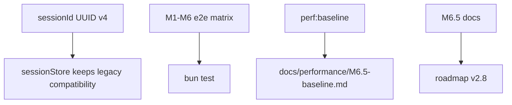

# M6.5 — Phase 1 收官稳定化

> 实施日期：2026-05-14
>
> 目标：完成 Phase 1 收官前的架构对齐与可回归基线：sessionId 切到 claude-code 同款 UUID v4、补齐 M1-M6 主路径 e2e、建立启动与单工具调用性能 baseline。

---

## 1. 设计总览

M6.5 是重构窗口，不新增用户级 agent 能力；重点是让 Phase 1 已有能力具备更稳定的回归边界。



---

## 2. sessionId 对齐

### 2.1 新策略

`generateSessionId()` 从 M6.5 起改为 `crypto.randomUUID()`，生成 canonical UUID v4：

```text
3f4e2b70-8f4a-4d47-9e4f-2c3b7f7a8e10
```

这样对齐 claude-code 的 session id 形态，也避免历史 timestamp+random 方案把排序语义和身份语义绑在一起。

### 2.2 向后兼容

只改变**新会话生成**。`sessionStore` 的 `/load` / `--resume` 不强制校验 UUID，因此历史文件名仍然可加载：

```text
~/.nova-code/sessions/2026-05-04T10-00-00-deadbeef.jsonl
```

新增单测覆盖 legacy timestamp sessionId 的 save/load 往返，防止后续误把历史文件拒绝掉。

---

## 3. E2E 覆盖矩阵

| Milestone | 现有 / 新增 e2e | 覆盖点 |
|---|---|---|
| M1/M1.5 | `m1-5-e2e-writeflow` | 真实子进程 + mock LLM，Grep → FileEdit → Bash 剧本 |
| M2 | `m2-e2e-chat` | 多轮上下文、`/save`、`--resume`、Ctrl+C 双按退出 |
| M3 | `m6-5-e2e-phase1` | ask 默认 acceptEdits 下 Bash headless deny；`--dangerously-skip-permissions` 放行普通 Bash |
| M4 | `m4-e2e-compact` | auto compact、手动 `/compact`、50 轮、CLAUDE.md @include |
| M5 | `m5-e2e-cost` | chat 退出打印 cost + ledger 落盘 |
| M6 | `m6-e2e-todowrite` | 复杂任务开头主动调用 TodoWrite，stderr 展示 ASCII todo list |

M6.5 不把性能 baseline 放进 `bun test`，避免机器负载导致测试 flaky；性能通过独立脚本记录。

---

## 4. Performance baseline

新增脚本：

```bash
bun run perf:baseline
bun run perf:baseline -- --runs=10
```

指标：

- `startup.version`：`nova-code --version` 子进程启动耗时；
- `ask.todo-write.single-tool-loop`：mock `todo-loop` 下的一次 `TodoWrite` 工具调用闭环。

当前 baseline 记录在 [docs/performance/M6.5-baseline.md](../performance/M6.5-baseline.md)。后续阶段若要做性能回归门禁，先比较同机同 Bun 版本下的 median；超过 20% 再调查。

---

## 5. 测试覆盖

新增 / 调整：

- `sessionId.test.ts`：UUID v4 生成、注入、非法生成器失败；
- `sessionStore.test.ts`：历史 timestamp sessionId 仍可加载；
- `m2-e2e-chat.test.ts`：`/save` 主文件名断言为 UUID v4；
- `perfBaseline.test.ts`：性能统计 helper 的 run count 与非法参数；
- `m6-5-e2e-phase1.test.ts`：权限主路径真实子进程覆盖。

---

## 6. 交叉引用

- [M6.5 使用手册](../manual/M6.5-usage-guide.md)
- [M6.5 架构文档](../architecture/M6.5-architecture.md)
- [Performance baseline](../performance/M6.5-baseline.md)
- [Roadmap](../roadmap.md)
