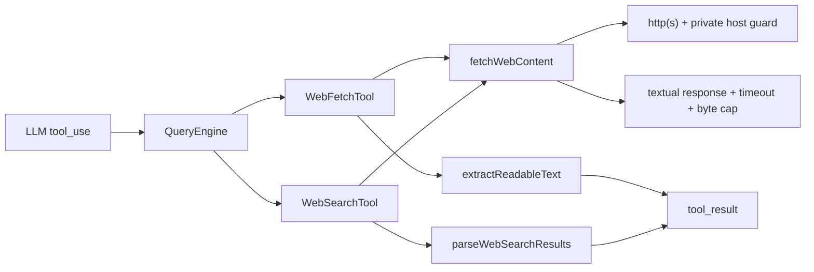

# M7 — Web 工具组

> 实施日期：2026-05-14
>
> 目标：新增 `WebFetch` / `WebSearch` 两个只读 Web 工具与网页正文抽取能力，让 agent 可读取公开网页、检索公开搜索结果，并保持离线可测与 SSRF 安全边界。

---

## 1. 设计总览

M7 在 M6 的 8 个内置工具基础上新增第 9 / 10 个工具：

- `WebFetch`：抓取公开 HTTP(S) URL，抽取 HTML / text / JSON / XML 中可读正文；
- `WebSearch`：通过轻量 HTML search endpoint 获取搜索结果标题与 URL，支持 allow / block 域名过滤；
- Web proxy routing：对配置命中的域名或模型显式判断为需代理的网站，通过用户配置的 HTTP(S) proxy 访问。



两者都是只读工具，`requiresApproval=false`；安全边界不靠用户审批，而靠 URL scheme、private/local host 拦截、超时和截断。

---

## 2. 对齐 claude-code 的点

| 维度 | claude-code | nova-code M7 |
|---|---|---|
| 工具名 | `WebFetch` / `WebSearch` | 同名 |
| WebFetch 输入 | `{ url, prompt }` | 同形；`prompt` 作为焦点说明回显给模型 |
| WebSearch 输入 | `{ query, allowed_domains?, blocked_domains? }` | 同形 |
| 工具定位 | 只读公开 Web 信息获取 | 同款能力边界 |
| 正文抽取 | 把网页转成适合模型消费的文本 | 手写 HTML noise stripping + entity decode |
| 域名过滤 | search 层 allow / block | 同形输入与后缀匹配语义 |

---

## 3. 明确差异

1. **WebSearch provider**：claude-code 在可用模型 / provider 下可走 Anthropic server-side web search；nova-code M7 仍是本地 Tool runtime，因此先实现 HTML endpoint 搜索，默认 endpoint 为 DuckDuckGo HTML，并允许 `NOVA_WEB_SEARCH_ENDPOINT` 覆盖用于测试或自托管。
2. **WebFetch prompt 不再嵌套 LLM**：claude-code 可把 fetched markdown 与 prompt 交给子模型处理；nova-code M7 只返回抽取正文和 prompt 文本，由主模型继续推理，避免在工具内再发起不可见 LLM 调用。
3. **无浏览器执行**：M7 不执行 JavaScript，不处理登录态、cookie、表单、SPA hydration；这属于后续浏览器 / MCP 能力。
4. **安全策略更保守**：默认拒绝 localhost、私网 IPv4/IPv6、link-local、carrier-grade NAT 等地址；本地 e2e 需显式设置 `NOVA_WEB_ALLOW_PRIVATE_HOSTS=1`。
5. **代理路由是显式能力**：claude-code 的 Web 工具可依赖运行环境网络；nova-code M7.1 增加 `webProxy` / `webProxyDomains` 与 `use_proxy`，让“哪些站点走代理”既能来自配置，也能由模型在工具调用时推理。

---

## 4. 工具接口

### 4.1 WebFetch

```ts
{
  url: string;
  prompt?: string;
  use_proxy?: boolean;
}
```

输出包含元信息与正文：

```text
Fetched: https://example.com/page
Status: 200 OK
Content-Type: text/html; charset=utf-8
Bytes: 12345
Prompt: summarize this page

<extracted readable text>
```

### 4.2 WebSearch

```ts
{
  query: string;
  allowed_domains?: string[];
  blocked_domains?: string[];
  use_proxy?: boolean;
}
```

约束：

- `query` trim 后至少 2 个字符；
- `allowed_domains` 与 `blocked_domains` 不能同时传；
- 域名过滤支持精确域名与子域名，例如 `example.com` 匹配 `docs.example.com`；
- `use_proxy=true` 表示模型推理目标站点或搜索 endpoint 需要通过配置代理访问。

---

## 5. 安全与资源边界

| 边界 | M7 策略 |
|---|---|
| URL scheme | 仅允许 `http:` / `https:` |
| SSRF | 默认拒绝 private/local host；测试环境才允许 `NOVA_WEB_ALLOW_PRIVATE_HOSTS=1` |
| 超时 | 单请求 15s |
| 响应类型 | 空 content-type 或 textual content-type：`text/*` / JSON / XML / XHTML |
| 字节上限 | 读取前 1MB 可见内容，保留原始 bytes 计数 |
| 字符上限 | WebFetch 返回正文最多 50K chars；WebSearch 解析 HTML 最多 200K chars |
| 认证 | 不传 cookie / token，不访问登录态页面 |
| 代理 | `webProxy` 支持 HTTP(S) proxy；`webProxyDomains` 命中或 `use_proxy=true` 时启用；输出只标记是否使用代理，不泄露代理凭证 |

private host guard 是防 SSRF 基线，不做 DNS 解析，因此不能完全防 DNS rebinding。后续若 WebFetch 要访问内网文档，应走权限系统或显式 workspace allowlist，而不是默认打开。

---

## 6. 代码组织

```text
src/tools/WebFetchTool/
├── constants.ts
├── extractReadableText.ts
├── fetchWebContent.ts
├── WebFetchTool.ts
└── WebFetchTool.test.ts

src/tools/WebSearchTool/
├── constants.ts
├── WebSearchTool.ts
└── WebSearchTool.test.ts
```

集成点：

- `src/tools.ts`：注册并导出 `WebFetchTool` / `WebSearchTool`；内置工具数变为 10。
- `src/services/api/mockClient.ts`：新增 `NOVA_MOCK_SCENARIO=web-loop`，按 `WebFetch → WebSearch → end_turn` 剧本返回。
- `src/m7-e2e-web.test.ts`：本地 HTTP fixture + mock LLM，验证 ask 主循环真实执行两个 Web 工具。
- `src/tools/WebFetchTool/webProxyConfig.ts`：读取 config/env，解析代理 URL 与域名规则，决定本次请求是否传 `fetch(..., { proxy })`。

---

## 7. 测试覆盖

| 测试 | 覆盖点 |
|---|---|
| `WebFetchTool.test.ts` | metadata、HTML 抽取、plain text、非 HTTP(S)、private host guard、非文本响应、entity decode |
| `WebSearchTool.test.ts` | metadata、anchor / DuckDuckGo `uddg` 解析、endpoint override、allow / block 域名过滤、互斥校验 |
| `tools.test.ts` | 10 个内置工具注册表与命名一致性 |
| `m7-e2e-web.test.ts` | ask + mock LLM 依次调用 WebFetch / WebSearch，本地 HTTP endpoint 被命中 |
| `webProxyConfig.test.ts` | env/config 代理合并、域名匹配、LLM `use_proxy` 强制代理、无代理配置错误 |

当前全量：663 tests 全绿（含 M7.1 代理路由增量）。

---

## 8. 后续预留

- M8 MCP 可接 Brave Search / Tavily 等 MCP server，届时 `WebSearch` 可作为内置 fallback。
- 若后续引入 provider-aware server-side web search，应把 provider 选择放到 services/api 层，而不是让 Tool 直接创建 Anthropic client。
- 若要支持 authenticated browsing，应单独建浏览器工具和 cookie 权限模型，不复用 M7 的无状态 fetch。
- HTML 抽取目前是轻量正则 pipeline；若出现复杂网页质量问题，可引入 Readability 类抽取器，但需先评估依赖体积和 Bun 兼容。

---

## 9. 交叉引用

- [M7 使用手册](../manual/M7-usage-guide.md)
- [M7 架构文档](../architecture/M7-architecture.md)
- [Roadmap](../roadmap.md)
