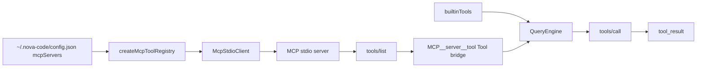

# M8 — MCP 客户端协议

> 实施日期：2026-05-15
>
> 目标：实现 MCP stdio client，让 nova-code 可从配置的 MCP server 动态发现工具，并把这些工具接入现有 QueryEngine 工具调用链路。

---

## 1. 设计总览

M8 新增一个 `services/mcp/` 子系统：启动用户配置的 MCP stdio server，完成 `initialize` / `notifications/initialized` / `tools/list` / `tools/call`，再把 MCP tool bridge 成 nova-code 的 `Tool`。



M8 首版只实现 **stdio transport + Tools capability**。M8.1 已补充 Streamable HTTP transport 与 `tools/list_changed` 刷新；Resources / Prompts / Sampling 仍不在本阶段范围内。

参考基线：

- MCP Base Protocol：<https://modelcontextprotocol.io/specification/2025-11-25/basic>
- MCP Transports：<https://modelcontextprotocol.io/specification/2025-11-25/basic/transports>
- MCP JSON-RPC schema：<https://modelcontextprotocol.io/specification/2025-11-25/schema>

---

## 2. 配置形态

M8 在 `PersistedConfig` / `ResolvedConfig` 中新增：

```ts
mcpServers?: {
  [name: string]: {
    type?: "stdio";
    command: string;
    args?: string[];
    env?: Record<string, string>;
    cwd?: string;
    disabled?: boolean;
    timeoutMs?: number;
    autoApprove?: boolean;
  };
};
```

设计取舍：

- `name` 限定为 `[A-Za-z0-9_-]+`，避免动态工具名不可控；
- `type` 在 M8 首版只允许 `stdio`；M8.1 起支持 `type: "http"` 的 Streamable HTTP server；
- `env` 支持 `$VAR` / `${VAR}` 运行时展开，便于 `BRAVE_API_KEY=${BRAVE_API_KEY}` 这类配置；
- `autoApprove` 是用户显式信任开关，默认 `false`。

---

## 3. MCP 工具命名

MCP tool 名可能包含 `_` / `-`，也可能与内置工具重名。M8 统一暴露为：

```text
MCP__<serverName>__<toolName>
```

其中非法字符替换为 `_`。

示例：

```text
server=filesystem, tool=read_file → MCP__filesystem__read_file
server=brave-search, tool=brave_web_search → MCP__brave_search__brave_web_search
```

这会偏离内置工具的 PascalCase 命名测试，但它是动态外部工具命名空间，设计上必须隔离。

---

## 4. 安全策略

MCP server 是外部进程，M8 安全边界采取“配置即能力，但默认仍需审批”：

| 维度 | 策略 |
|---|---|
| server 启动 | 只启动用户显式配置的 `mcpServers` |
| 工具审批 | 默认 `requiresApproval=true`，进入 M3 权限系统 |
| 自动放行 | 仅当 server 配置 `autoApprove=true` |
| MCP annotations | `readOnlyHint` 等只作为描述，不自动信任 |
| 失败隔离 | 单个 server 启动失败只产生 warning，不阻断内置工具 |
| secret 泄漏 | `config get` 全量输出会把 MCP `env` 值统一脱敏 |

ask 默认 `acceptEdits` 模式不会自动放行 MCP 工具；用户可选择：

1. 在 chat 里交互审批；
2. 为工具写 permission allow 规则；
3. 对可信 server 设置 `autoApprove=true`；
4. 或临时使用 `--dangerously-skip-permissions`。

---

## 5. 与 claude-code 的差异

| 维度 | claude-code | nova-code M8 |
|---|---|---|
| MCP 范围 | 更完整的 MCP 子系统 | 仅 stdio + tools |
| 工具名 | 内部有映射和 UI 展示 | `MCP__server__tool` 显式命名空间 |
| 失败处理 | 更深 UI 集成 | server 启动失败 warning + 跳过 |
| 安全默认 | 依赖其权限系统 | MCP tool 默认需要审批；`autoApprove` 才免审批 |
| SDK 依赖 | 可随官方 SDK 走 | M8 手写最小 JSON-RPC stdio client，降低 SDK 版本漂移风险 |

手写最小 client 的原因：MCP SDK/协议仍在演进，当前阶段只需要稳定的四个方法；少引依赖能让协议边界更清晰，也便于测试 fixture 覆盖。

---

## 6. 测试覆盖

| 测试 | 覆盖点 |
|---|---|
| `McpStdioClient.test.ts` | stdio initialize / tools/list / tools/call |
| `mcpToolRegistry.test.ts` | MCP tool name、Tool bridge、startup warning |
| `McpCommand.test.ts` | `mcp add/list/remove/tools` 配置管理 |
| `m8-e2e-mcp.test.ts` | ask + mock LLM 调用动态 MCP tool |
| `config.test.ts` | `mcpServers` 校验、默认值、保存加载 |
| `ConfigCommand.test.ts` | MCP env 脱敏输出 |

---

## 7. DoD 状态

M8 已具备接入公开 stdio MCP server 的能力。手册给出 filesystem / git / brave-search 配置模板；真实第三方 server 是否可运行取决于用户本机是否安装对应运行时与 API key。

M8 本地 DoD 验证使用仓库内 `stdioEchoServer.ts` fixture，避免 CI 依赖外网和第三方包。

---

## 8. 后续预留

- ✅ M8.1：支持 Streamable HTTP transport；
- ✅ M8.1：读取 `tools/list_changed` notification 并刷新工具列表；
- M9：Skills 可根据 MCP server/tool 描述自动激活领域提示；
- M10：Hooks 可拦截 MCP tool call 前后；
- M12：多 provider 下统一处理 MCP tool schema 兼容差异。

---

## 9. 交叉引用

- [M8 使用手册](../manual/M8-usage-guide.md)
- [M8 架构文档](../architecture/M8-architecture.md)
- [M8.1 设计文档](./M8.1-mcp-http-refresh.md)
- [Roadmap](../roadmap.md)
