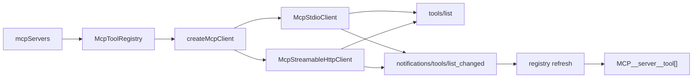

# M8.1 — MCP Streamable HTTP 与工具列表刷新

> 实施日期：2026-05-16
>
> 目标：在 M8 stdio MCP client 基础上补齐 Streamable HTTP transport，并消费 `notifications/tools/list_changed` 以刷新动态 MCP 工具列表。

---

## 1. 设计总览

M8.1 不改变 QueryEngine 的工具调用协议，而是在 `services/mcp/` 内把 transport 层从单一 stdio 扩展为 stdio / Streamable HTTP 双实现：



协议参考：

- MCP Transports：<https://modelcontextprotocol.io/specification/2025-11-25/basic/transports>
- MCP Tools：<https://modelcontextprotocol.io/specification/2025-11-25/server/tools>
- MCP Schema：<https://modelcontextprotocol.io/specification/2025-11-25/schema>

---

## 2. Streamable HTTP config

`mcpServers` 现在支持两种 server config：

```ts
type McpServerConfig =
  | {
      type?: "stdio";
      command: string;
      args?: string[];
      env?: Record<string, string>;
      cwd?: string;
      disabled?: boolean;
      timeoutMs?: number;
      autoApprove?: boolean;
    }
  | {
      type: "http";
      url: string;
      headers?: Record<string, string>;
      disabled?: boolean;
      timeoutMs?: number;
      autoApprove?: boolean;
    };
```

设计取舍：

- `type` 继续兼容 M8：缺省视为 `stdio`；
- HTTP endpoint 只允许 `http:` / `https:`；
- `headers` 用于 `Authorization` 等静态认证头，值支持 `$VAR` / `${VAR}` 环境展开；
- `config get` 会对 HTTP `headers` 与 stdio `env` 一样脱敏；
- `autoApprove` 仍只是用户显式信任开关，HTTP MCP 工具默认也需要审批。

---

## 3. Streamable HTTP 行为

`McpStreamableHttpClient` 实现最小 MCP HTTP client：

| 能力 | 行为 |
|---|---|
| 初始化 | `POST initialize`，发送 `MCP-Protocol-Version`，保存响应里的 `MCP-Session-Id` |
| initialized | `POST notifications/initialized`，接受 `202 Accepted` |
| request | 每次 `POST` 一个 JSON-RPC request，`Accept: application/json, text/event-stream` |
| JSON response | 解析单个 JSON-RPC response |
| SSE response | 读取 `text/event-stream`，直到匹配 request id 的 response |
| server request | 支持 `ping`，未知 request 返回 `-32601` |
| GET SSE | 初始化后尝试 `GET` endpoint 读取 server-to-client notifications；`405` 视为 server 不支持，不报错 |
| close | abort GET SSE；若存在 session id，则 best-effort `DELETE` |

不做的事：

- 不实现 resumability / Last-Event-ID；
- 不做 HTTP reconnect policy；
- 不支持 resources / prompts / sampling；
- 不自动信任 server-reported annotations。

---

## 4. `tools/list_changed` 刷新

M8.1 在 registry 层处理通知：

1. 每个 client 暴露 `onNotification(listener)`；
2. stdio 从 stdout JSON-RPC notification 读取；
3. HTTP 从 GET SSE 或 POST SSE response 中读取；
4. registry 看到 `notifications/tools/list_changed` 后调用对应 server 的 `tools/list`；
5. 刷新完成后重新 bridge 为 `MCP__<server>__<tool>` 工具数组。

刷新策略：

- 单 server 刷新失败只追加 warning，不关闭 registry；
- 同一 server 连续通知会合并，正在刷新时再收到通知会再跑一轮；
- chat REPL 每轮用户输入前重新读取 registry 当前工具列表，因此下一轮可见最新 MCP tools；
- ask 单次调用仍以启动时工具列表为主，避免单轮 LLM 请求中途改变 tool schema。

---

## 5. CLI 变化

新增：

```bash
nova-code mcp add-http <name> \
  [--auto-approve] \
  [--timeout-ms <ms>] \
  [--header KEY=VALUE] \
  <url>
```

示例：

```bash
nova-code mcp add-http remote \
  --header 'Authorization=Bearer ${MCP_TOKEN}' \
  https://mcp.example.com/mcp
```

`nova-code mcp list` 对 HTTP server 输出：

```text
remote  enabled  http https://mcp.example.com/mcp
```

---

## 6. 测试覆盖

| 测试 | 覆盖点 |
|---|---|
| `McpStreamableHttpClient.test.ts` | HTTP initialize / JSON response / SSE response / GET SSE notification / header env expansion |
| `mcpToolRegistry.test.ts` | stdio `tools/list_changed` 后 registry 自动刷新 tool bridge |
| `McpCommand.test.ts` | `mcp add-http` 写入配置、`mcp list` 展示 HTTP server |
| `config.test.ts` | HTTP MCP config 校验 |
| `ConfigCommand.test.ts` | HTTP MCP headers 脱敏 |

---

## 7. 交叉引用

- [M8.1 使用手册](../manual/M8.1-usage-guide.md)
- [M8.1 架构文档](../architecture/M8.1-architecture.md)
- [M8 设计文档](./M8-mcp-client.md)
- [Roadmap](../roadmap.md)
