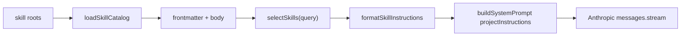

# M9 — Skills 系统

> 实施日期：2026-05-17
>
> 目标：支持加载 `~/.agents/skills/**/SKILL.md` 形态的领域提示词包，并在 ask/chat 中按用户 query 自动激活后注入 system prompt。

---

## 1. 设计总览

M9 把 Skills 作为“可装载的提示词包”，不引入新工具执行权限，也不改变 QueryEngine 的消息协议。运行时流程如下：



默认 root 顺序：

1. `<cwd>/.nova-code/skills`
2. `~/.nova-code/skills`
3. `~/.agents/skills`

同名 skill 采用“先发现者 wins”，因此 project skill 能覆盖 user/global skill。

---

## 2. Skill 文件形态

M9 对齐当前 `~/.agents/skills/<name>/SKILL.md` 的事实形态：

```md
---
name: java
description: Java JVM backend and concurrency review skill.
allowed-tools:
  - Read
  - Grep
---
# Java Skill

具体指导内容……
```

frontmatter 解析采用零依赖 YAML 子集：

- 顶层 `key: value`
- block scalar：`description: |`
- 简单数组：`allowed-tools: [Read, Grep]` 或多行 `- Read`
- 基础 scalar：string / number / boolean

M9 只消费：`name`、`description`、`version`、`preamble-tier`、`allowed-tools`。`allowed-tools` 当前只展示/保留元数据，不参与权限放行。

---

## 3. 自动激活策略

激活分两层：

| 层级 | 规则 | 说明 |
|---|---|---|
| 显式触发 | `/name`、`$name`、`skill:name` | manual-only skill 也可被触发 |
| 关键词触发 | query 与 `name + description` token 重叠 | `MANUAL TRIGGER ONLY` skill 不参与自动触发 |

工程取舍：

- 不调用 LLM 做 routing，避免每轮额外 token/latency；
- 默认最多注入 3 个 skill，防止 prompt 膨胀；
- `MANUAL TRIGGER ONLY` 通过 description/body 中的标记识别，兼容 gstack 类 skill；
- 中文目前只做 Unicode token 粗匹配，后续 Beyond 可升级为 embedding/LLM router。

---

## 4. Prompt 注入边界

Skills 指令被格式化为独立 block，并与 CLAUDE.md 结果合并后复用现有 `projectInstructions` 通道：

```text
Activated skill instructions are shown below...

## Skill: java
Description: ...
Activation: keyword; matched: java
Source: /abs/path/SKILL.md

<skill body>
```

边界控制：

- 每个 skill 最多 24k 字符；
- 单次 Skills prompt 最多 60k 字符；
- project/user instructions 仍声明为优先级更高；
- ask 每次按问题激活；chat 启动时加载 catalog，每轮按当前用户输入激活。

---

## 5. CLI

新增：

```bash
nova-code skill list
nova-code skill show <name>
nova-code skill match <query...>
```

用途：

- `list`：确认当前 roots 下实际加载到了哪些 skill；
- `show`：查看某个 skill 的 description、manual-only 状态、路径与正文；
- `match`：调试某条 query 会激活哪些 skill。

---

## 6. 与 claude-code 的差异

| 维度 | claude-code | nova-code M9 |
|---|---|---|
| 文件形态 | `~/.agents/skills/**/SKILL.md` | 兼容同款形态 |
| 加载 | 偏全量提示/命令驱动 | catalog 全量加载，但按 query 注入子集 |
| manual-only | 依赖 skill 描述约定 | 显式识别 `MANUAL TRIGGER ONLY`，不自动激活 |
| frontmatter | 完整生态字段更多 | 只解析 M9 必需 YAML 子集 |
| 权限 | skill 可声明 allowed tools | M9 只保留元数据，不改变 M3 权限系统 |

关键差异是“自动激活只注入匹配 skill”，这是 nova 的改进点：少占 token、减少不相关指令冲突，同时保留显式 `/name` 控制。

---

## 7. 测试覆盖

| 测试 | 覆盖点 |
|---|---|
| `src/services/skills/skills.test.ts` | frontmatter、root 解析、catalog loading、manual-only、关键词匹配、prompt 格式 |
| `src/commands/SkillCommand/SkillCommand.test.ts` | `skill list/show/match` CLI |
| `src/m9-e2e-skills.test.ts` | 子进程 ask + mock LLM，验证 system prompt 注入 skill body |
| `src/commands.test.ts` / `src/cli.test.ts` | builtin command/help 注册 |

---

## 8. 后续预留

- `allowed-tools` 与 M3 permission rule 的安全映射；
- skill 安装/升级命令；
- embedding 或 LLM router 做更强语义匹配；
- project-local skill 热加载；
- 将 successful workflow 自动沉淀为 skill（Phase 3 Self-improvement）。

---

## 9. 交叉引用

- [M9 使用手册](../manual/M9-usage-guide.md)
- [M9 架构文档](../architecture/M9-architecture.md)
- [Roadmap](../roadmap.md)
